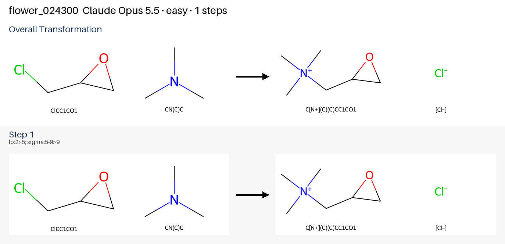
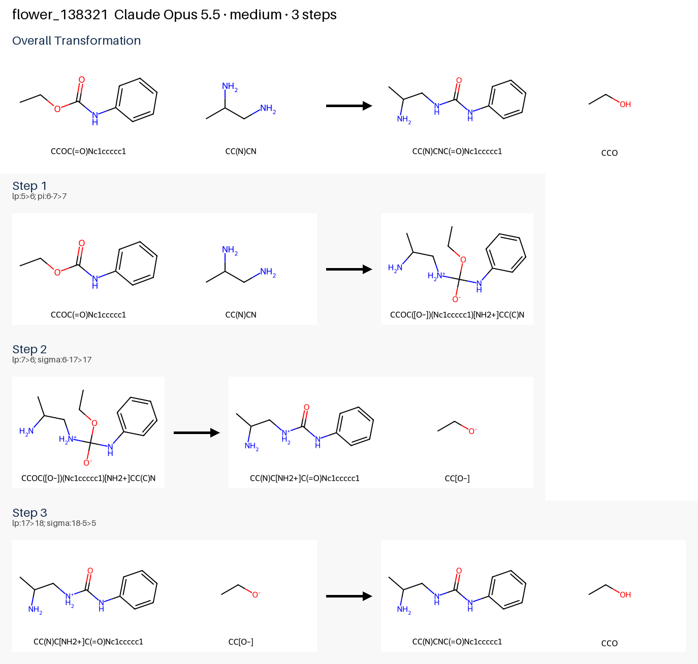
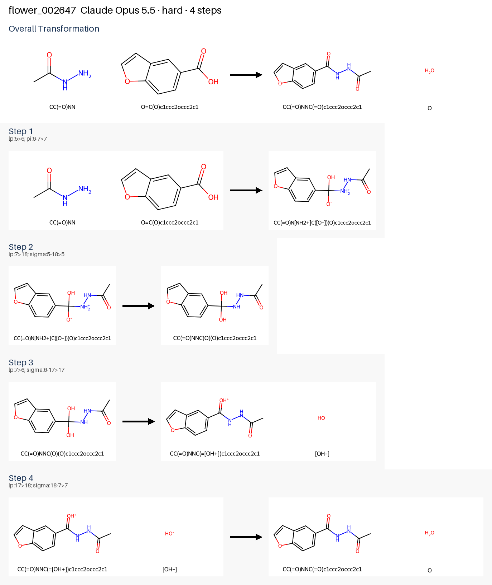

# Leaderboard

Blind mechanism prediction on FlowER-derived development tiers (easy = 1–2 steps, medium = 3, hard = 4–8), 10 cases per tier. A step is accepted only when deterministic RDKit validators pass it. Score is the 1000-point eval rubric: product 300, pathway 300, electron pushes 200, speed 100, methodology 100 (WIN ≥ 700).

Generated by `python main.py publish-results` from the records in [`results/runs/`](results/runs/). Do not edit by hand.

## Best model by tier

| Tier | Best model | Score | Targets reached | Passed | Harness | Date | Details |
|---|---|---|---|---|---|---|---|
| easy | **Claude Opus 5.5** | **940**/1000 | 10/10 | 10/10 | `default` | 2026-09-29 | [results](#2026-09-29-cli-eval-opus55-easy) |
| medium | **Claude Opus 5.5** † | **904**/1000 | 10/10 | 10/10 | `jev_reaction_type` | 2026-09-29 | [results](#2026-09-29-bridge-opus55-jev-medium) |
| hard | **Claude Opus 5.5** † | **823**/1000 | 10/10 | 9/10 | `jev_reaction_type` | 2026-09-29 | [results](#2026-09-29-bridge-opus55-jev-hard) |

† Answered through the [agent bridge](docs/agent_bridge.md): each model call went to the declared model in a fresh session that saw only the harness prompt (`responder_saw_ground_truth: false`). Cost is opaque, so these rows make no cost claim.

## Published runs

### easy · **Claude Opus 5.5** † · 2026-09-29

- **939/1000 (WIN)** — product 300, pathway 269, pushes 196, speed 74, methodology 100
- Targets reached 10/10, passed 10/10, mean case score 0.945, 104.7 s/case
- Model id `agent-bridge`, harness `jev_reaction_type`, run group `bridge_opus55_jev_easy_r2`, eval run `ec4439ff14404613b31c2419b4af72d1`, commit `71bdae4` — [record](results/runs/2026-09-29_bridge_opus55_jev_easy_r2.json)

| Case | Known steps | Accepted steps | Target | Passed | Score |
|---|---|---|---|---|---|
| `flower_024300` | 1 | 1 | ✓ | ✓ | 1.000 |
| `flower_054599` | 1 | 1 | ✓ | ✓ | 1.000 |
| `flower_085506` | 1 | 1 | ✓ | ✓ | 1.000 |
| `flower_086646` | 1 | 1 | ✓ | ✓ | 1.000 |
| `flower_130926` | 1 | 1 | ✓ | ✓ | 1.000 |
| `flower_135501` | 1 | 3 | ✓ | ✓ | 0.726 |
| `flower_160718` | 1 | 3 | ✓ | ✓ | 0.726 |
| `flower_170958` | 1 | 1 | ✓ | ✓ | 1.000 |
| `flower_188703` | 1 | 1 | ✓ | ✓ | 1.000 |
| `flower_252433` | 1 | 1 | ✓ | ✓ | 1.000 |

Hardest mechanism solved: `flower_024300` — reference 1 steps, predicted 1 steps, case score 1.000

### easy · **Claude Opus 5.5** · 2026-09-29

- **940/1000 (WIN)** — product 300, pathway 269, pushes 196, speed 75, methodology 100
- Targets reached 10/10, passed 10/10, mean case score 0.945, 100.3 s/case
- Model id `anthropic/claude-opus-5.5`, harness `default`, run group `cli_eval_opus55_easy`, eval run `d7b83c6963da4e2a9405f333d3f05b0d`, commit `71bdae4` — [record](results/runs/2026-09-29_cli_eval_opus55_easy.json)

| Case | Known steps | Accepted steps | Target | Passed | Score |
|---|---|---|---|---|---|
| `flower_024300` | 1 | 1 | ✓ | ✓ | 1.000 |
| `flower_054599` | 1 | 1 | ✓ | ✓ | 1.000 |
| `flower_085506` | 1 | 1 | ✓ | ✓ | 1.000 |
| `flower_086646` | 1 | 1 | ✓ | ✓ | 1.000 |
| `flower_130926` | 1 | 1 | ✓ | ✓ | 1.000 |
| `flower_135501` | 1 | 3 | ✓ | ✓ | 0.726 |
| `flower_160718` | 1 | 3 | ✓ | ✓ | 0.726 |
| `flower_170958` | 1 | 1 | ✓ | ✓ | 1.000 |
| `flower_188703` | 1 | 1 | ✓ | ✓ | 1.000 |
| `flower_252433` | 1 | 1 | ✓ | ✓ | 1.000 |

Hardest mechanism solved: `flower_024300` — reference 1 steps, predicted 1 steps, case score 1.000

### medium · **Claude Opus 5.5** † · 2026-09-29

- **904/1000 (WIN)** — product 300, pathway 254, pushes 191, speed 59, methodology 100
- Targets reached 10/10, passed 10/10, mean case score 0.946, 164.1 s/case
- Model id `agent-bridge`, harness `jev_reaction_type`, run group `bridge_opus55_jev_medium`, eval run `c7abe8589ecc41198d1ae76e5e598160`, commit `71bdae4` — [record](results/runs/2026-09-29_bridge_opus55_jev_medium.json)

| Case | Known steps | Accepted steps | Target | Passed | Score |
|---|---|---|---|---|---|
| `flower_058277` | 3 | 2 | ✓ | ✓ | 0.951 |
| `flower_077973` | 3 | 2 | ✓ | ✓ | 0.951 |
| `flower_102973` | 3 | 2 | ✓ | ✓ | 0.853 |
| `flower_103167` | 3 | 2 | ✓ | ✓ | 0.951 |
| `flower_122060` | 3 | 2 | ✓ | ✓ | 0.853 |
| `flower_138321` | 3 | 3 | ✓ | ✓ | 1.000 |
| `flower_156414` | 3 | 2 | ✓ | ✓ | 0.951 |
| `flower_175010` | 3 | 2 | ✓ | ✓ | 0.951 |
| `flower_184403` | 3 | 3 | ✓ | ✓ | 1.000 |
| `flower_254799` | 3 | 3 | ✓ | ✓ | 1.000 |

Hardest mechanism solved: `flower_138321` — reference 3 steps, predicted 3 steps, case score 1.000

### hard · **Claude Opus 5.5** † · 2026-09-29

- **823/1000 (WIN)** — product 300, pathway 220, pushes 187, speed 16, methodology 100
- Targets reached 10/10, passed 9/10, mean case score 0.836, 334.1 s/case
- Model id `agent-bridge`, harness `jev_reaction_type`, run group `bridge_opus55_jev_hard`, eval run `fad35afffe974a6a89cc1edd6b65d8a0`, commit `71bdae4` — [record](results/runs/2026-09-29_bridge_opus55_jev_hard.json)

| Case | Known steps | Accepted steps | Target | Passed | Score |
|---|---|---|---|---|---|
| `flower_002647` | 4 | 4 | ✓ | ✓ | 1.000 |
| `flower_007666` | 4 | 4 | ✓ | ✓ | 1.000 |
| `flower_025913` | 4 | 5 | ✓ | ✗ | 0.421 |
| `flower_054101` | 4 | 5 | ✓ | ✓ | 0.812 |
| `flower_085811` | 4 | 5 | ✓ | ✓ | 0.812 |
| `flower_137708` | 4 | 5 | ✓ | ✓ | 0.812 |
| `flower_140886` | 4 | 5 | ✓ | ✓ | 0.900 |
| `flower_160564` | 4 | 6 | ✓ | ✓ | 0.792 |
| `flower_165851` | 4 | 4 | ✓ | ✓ | 1.000 |
| `flower_212722` | 4 | 5 | ✓ | ✓ | 0.812 |

Hardest mechanism solved: `flower_002647` — reference 4 steps, predicted 4 steps, case score 1.000

---

Official holdout results and the historical Clawdiators arena material are in [docs/legacy/clawdiators_leaderboard.md](docs/legacy/clawdiators_leaderboard.md).
