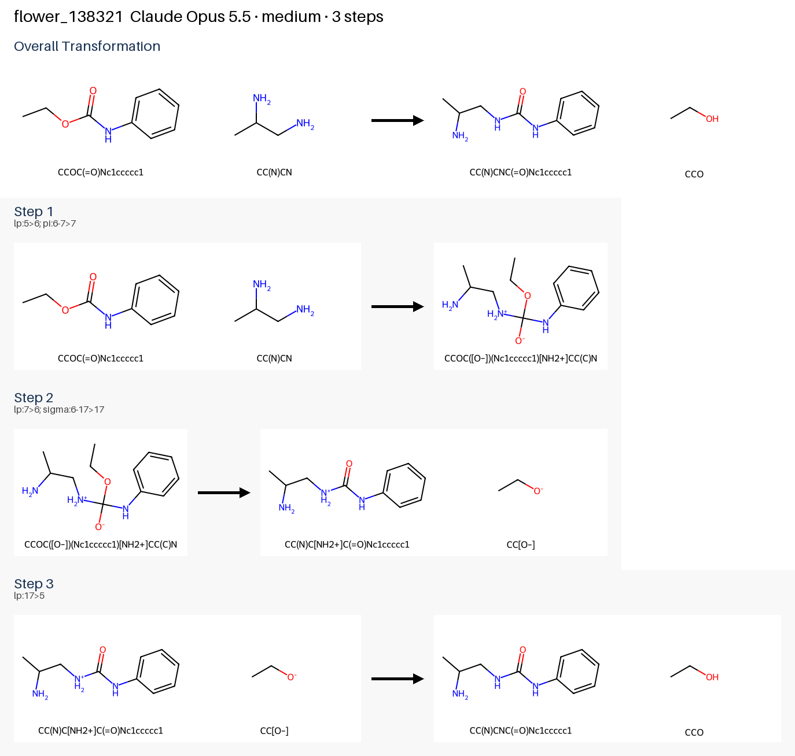
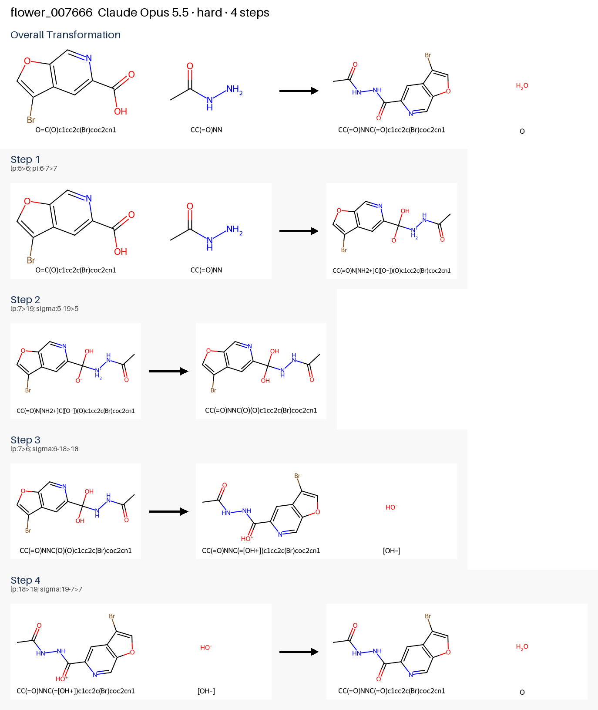
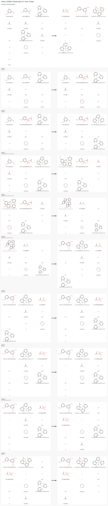
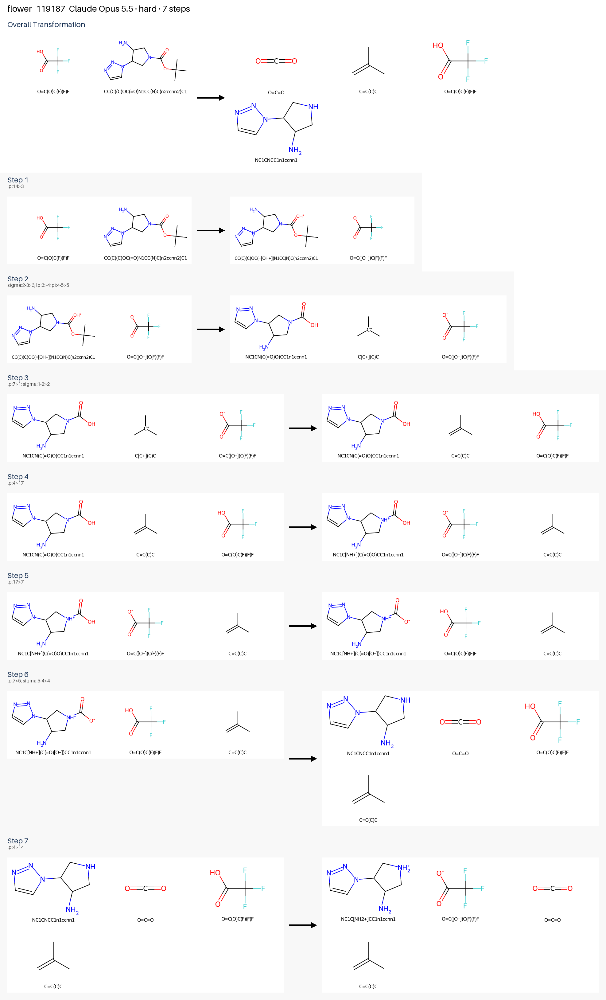
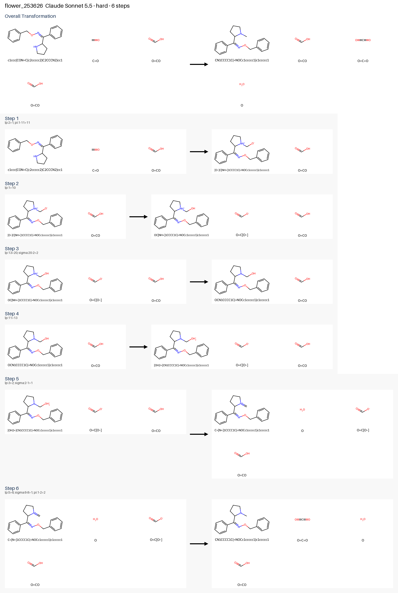
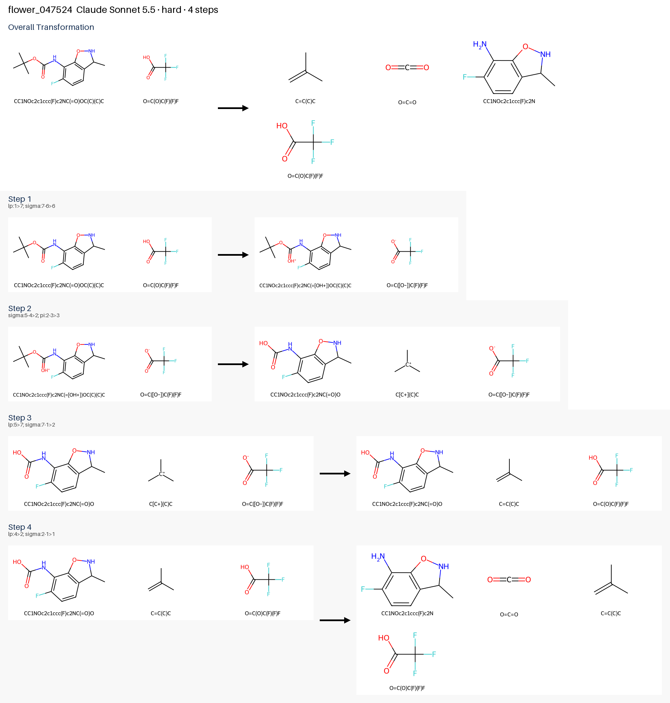

# Leaderboard

Blind mechanism prediction on FlowER-derived development tiers (easy = 1–2 steps, medium = 3, hard = 4–10), 10 cases per tier.

Every mechanism, harness or harness-free baseline, is scored by the same `quality_v1` rubric (`mechanistic_agent/quality_scoring.py`, [docs/scoring_quality_v1.md](docs/scoring_quality_v1.md)). Each accepted step is re-checked with the same deterministic code whatever produced it. The target product is given in the prompt, so reaching it earns no points: it is a gate (a mechanism that misses a target scores half and cannot pass). There are no speed points.

| Component | Points | Earned by |
|---|---|---|
| Step validity | 250 | atom and charge balance, arrows that parse into a bond/electron change, SMIRKS that match the stated species, state progress |
| Sequence | 200 | heavy-atom events in the FlowER reference order; proton-shuttle choice is not penalized |
| Electron conservation | 100 | every step conserves electrons in the bond-electron matrix |
| Proton sources/sinks | 100 | protons move between explicit donors and acceptors (no bare H+); net protons close |
| Protonation states | 100 | no free strong base under acidic conditions, no free strong acid under basic conditions |
| Reagents & solvent | 100 | every species entering a step was supplied or made earlier; mass and charge close |
| Efficiency | 100 | no repeated or undone states, no heavy-atom steps beyond the reference |
| Intermolecular | 50 | proton transfers use an available shuttle (solvent, acid, base) rather than an intramolecular shift |

A case passes when every target is reached, every step is valid, the mechanism closes in mass and charge, no state repeats, and it scores at least 700. Harness and baseline rows are compared at the same thinking level.

**No-product rows** (the model had to predict the product): the main product, in any protonation state, is worth 300 points and the eight components share the other 700. The **Mechanism** column is always the eight components on 1000 before any product gate or product points, so it compares directly between product-given and no-product rows; per-component columns are shown on the 1000 scale too.

Generated by `python main.py publish-results` from the records in [`results/runs/`](results/runs/). Do not edit by hand.

## Best model by tier

| Tier | Best model | Thinking | Quality | Valid steps | Passed | Harness | Date | Details |
|---|---|---|---|---|---|---|---|---|
| easy | **Claude Opus 5.5** † | default | **976**/1000 | 86% | 8/10 | `jev_reaction_type` | 2026-09-30 | [results](#2026-09-30-bridge-opus55-jev-deferred-easy-final3) |
| medium | **Claude Opus 5.5** † | default | **965**/1000 | 100% | 10/10 | `jev_reaction_type` | 2026-09-30 | [results](#2026-09-30-bridge-opus55-jev-deferred-medium-final2-resumed) |
| hard | **Claude Opus 5.5** † | default | **927**/1000 | 96% | 8/10 | `jev_reaction_type` | 2026-09-29 | [results](#2026-09-29-bridge-opus55-jev-hard) |

## Harness vs harness-free baseline

Paired runs (same cases, model and thinking level):

| Cases | Product | Thinking | Model | One-shot baseline | Harness | Mechanism Δ |
|---|---|---|---|---|---|---|
| 10 hard (trial_quality_v1_hard10) | given | low | **Claude Opus 5.5** † | **911** (mechanism 911, pass 7/10) | **916** (mechanism 964, pass 7/10) | +53 |
| 10 hard (trial_quality_v1_hard10) | given | low | **Claude Sonnet 5.5** † | **762** (mechanism 796, pass 1/10) | **848** (mechanism 940, pass 5/10) | +144 |
| 10 hard (trial_quality_v1_hard10) | hidden | low | **Claude Opus 5.5** † | **863** (mechanism 847, product 9/10, pass 2/10) | **895** (mechanism 936, product 8/10, pass 4/10) | +89 |
| 10 hard (trial_quality_v1_hard10) | hidden | low | **Claude Sonnet 5.5** † | **781** (mechanism 773, product 8/10, pass 1/10) | **828** (mechanism 839, product 8/10, pass 4/10) | +66 |

Same cases, same model, same thinking level. **Mechanism** is the eight-component `quality_v1` score on 1000 (step validity, sequence, electron conservation, proton sources/sinks, protonation states, reagents, efficiency, intermolecular shuttles) and compares across modes; with the product **hidden** the model must also predict it, worth 300 of the 1000 points. A pass needs the product, every step valid, a mechanism that closes in mass and charge, and ≥ 700.

All `quality_v1` runs:

| Tier | Model | Mode | Thinking | Cases | Quality | Mechanism | Product | Step validity | Sequence | Electron conservation | Proton sources/sinks | Protonation states | Reagents & solvent | Efficiency | Intermolecular | Valid steps | Passed | Date | Record |
|---|---|---|---|---|---|---|---|---|---|---|---|---|---|---|---|---|---|---|---|---|
| easy | **Claude Opus 5.5** † | harness `jev_reaction_type` | default | 10 | **976** | 976 | given | 242 | 200 | 100 | 90 | 100 | 94 | 100 | 50 | 86% | 8/10 | 2026-09-29 | [json](results/runs/2026-09-29_bridge_opus55_jev_easy_r2.json) |
| easy | **Claude Opus 5.5** | harness `default` | default | 10 | **976** | 976 | given | 242 | 200 | 100 | 90 | 100 | 94 | 100 | 50 | 86% | 8/10 | 2026-09-29 | [json](results/runs/2026-09-29_cli_eval_opus55_easy.json) |
| easy | **Claude Opus 5.5** † | harness `jev_reaction_type` | default | 10 | **976** | 976 | given | 242 | 200 | 100 | 90 | 100 | 94 | 100 | 50 | 86% | 8/10 | 2026-09-30 | [json](results/runs/2026-09-30_bridge_opus55_jev_deferred_easy_final3.json) |
| medium | **Claude Opus 5.5** † | harness `jev_reaction_type` | default | 10 | **965** | 965 | given | 250 | 200 | 100 | 100 | 100 | 100 | 100 | 15 | 100% | 10/10 | 2026-09-29 | [json](results/runs/2026-09-29_bridge_opus55_jev_medium.json) |
| medium | **Claude Opus 5.5** † | harness `jev_reaction_type` | default | 10 | **965** | 965 | given | 250 | 200 | 100 | 100 | 100 | 100 | 100 | 15 | 100% | 10/10 | 2026-09-30 | [json](results/runs/2026-09-30_bridge_opus55_jev_deferred_medium_final2_resumed.json) |
| hard | **Claude Opus 5.5** † | harness `jev_reaction_type` | default | 10 | **927** | 927 | given | 247 | 166 | 100 | 90 | 95 | 94 | 96 | 39 | 96% | 8/10 | 2026-09-29 | [json](results/runs/2026-09-29_bridge_opus55_jev_hard.json) |
| hard | **Claude Opus 5.5** † | harness `jev_reaction_type` | low | 10 | **916** | 964 | given | 248 | 181 | 100 | 90 | 100 | 94 | 100 | 50 | 97% | 7/10 | 2026-10-05 | [json](results/runs/2026-10-05_trial_q5_harness_low_given_resumed.json) |
| hard | **Claude Opus 5.5** † | baseline | low | 10 | **911** | 911 | given | 241 | 160 | 91 | 89 | 94 | 90 | 100 | 46 | 86% | 7/10 | 2026-10-05 | [json](results/runs/2026-10-05_harness_free_baseline_claude-opus-5-5_81593488.json) |
| hard | **Claude Opus 5.5** † | harness `jev_reaction_type` · no product | low | 10 | **895** | 936 | 8/10 | 248 | 170 | 100 | 80 | 100 | 89 | 100 | 49 | 96% | 4/10 | 2026-10-05 | [json](results/runs/2026-10-05_trial_q5_harness_low_noprod_resumed.json) |
| hard | **Claude Opus 5.5** † | baseline · no product | low | 10 | **863** | 847 | 9/10 | 242 | 153 | 87 | 58 | 94 | 68 | 98 | 46 | 89% | 2/10 | 2026-10-05 | [json](results/runs/2026-10-05_harness_free_baseline_no_product_claude-opus-5-5_064f00ba.json) |
| hard | **Claude Sonnet 5.5** † | harness `jev_reaction_type` | low | 10 | **848** | 940 | given | 247 | 168 | 98 | 85 | 100 | 92 | 100 | 50 | 94% | 5/10 | 2026-10-10 | [json](results/runs/2026-10-10_sonnet55_harn_given.json) |
| hard | **Claude Sonnet 5.5** † | harness `jev_reaction_type` · no product | low | 10 | **828** | 839 | 8/10 | 223 | 152 | 90 | 70 | 90 | 79 | 90 | 45 | 95% | 4/10 | 2026-10-10 | [json](results/runs/2026-10-10_sonnet55_harn_hidden.json) |
| hard | **Claude Sonnet 5.5** † | baseline · no product | low | 10 | **781** | 773 | 8/10 | 174 | 163 | 35 | 72 | 97 | 86 | 100 | 45 | 22% | 1/10 | 2026-10-10 | [json](results/runs/2026-10-10_harness_free_baseline_no_product_claude-sonnet-5-5_bdb3b3d0.json) |
| hard | **Claude Sonnet 5.5** † | baseline | low | 10 | **762** | 796 | given | 156 | 163 | 33 | 100 | 100 | 100 | 98 | 46 | 8% | 1/10 | 2026-10-10 | [json](results/runs/2026-10-10_harness_free_baseline_claude-sonnet-5-5_56a80975.json) |

Baselines make one full-mechanism call with no harness. Their steps are scored exactly like harness steps, so an unbalanced or unparseable step costs the same.

† Answered through the [agent bridge](docs/agent_bridge.md): each model call went to the declared model in a fresh session that saw only the prompt (`responder_saw_ground_truth: false`). Cost is opaque, so these rows make no cost claim.

## Published runs

### easy · **Claude Opus 5.5** † · 2026-09-29

- **976/1000** — step validity 242, sequence 200, electron conservation 100, proton sources/sinks 90, protonation states 100, reagents & solvent 94, efficiency 100, intermolecular 50
- Targets reached 10/10, passed 8/10, valid steps 86%, thinking `default`
- Model id `agent-bridge`, harness `jev_reaction_type`, run group `bridge_opus55_jev_easy_r2`, eval run `ec4439ff14404613b31c2419b4af72d1`, commit `ec8e137` — [record](results/runs/2026-09-29_bridge_opus55_jev_easy_r2.json)

| Case | Known steps | Accepted steps | Valid steps | Target | Passed | Quality |
|---|---|---|---|---|---|---|
| `flower_024300` | 1 | 1 | 1/1 | ✓ | ✓ | 1000 |
| `flower_054599` | 1 | 1 | 1/1 | ✓ | ✓ | 1000 |
| `flower_085506` | 1 | 1 | 1/1 | ✓ | ✓ | 1000 |
| `flower_086646` | 1 | 1 | 1/1 | ✓ | ✓ | 1000 |
| `flower_130926` | 1 | 1 | 1/1 | ✓ | ✓ | 1000 |
| `flower_135501` | 1 | 3 | 2/3 | ✓ | ✗ | 880 |
| `flower_160718` | 1 | 3 | 2/3 | ✓ | ✗ | 880 |
| `flower_170958` | 1 | 1 | 1/1 | ✓ | ✓ | 1000 |
| `flower_188703` | 1 | 1 | 1/1 | ✓ | ✓ | 1000 |
| `flower_252433` | 1 | 1 | 1/1 | ✓ | ✓ | 1000 |

Hardest mechanism solved: `flower_024300` — reference 1 steps, predicted 1 steps

### easy · **Claude Opus 5.5** · 2026-09-29

- **976/1000** — step validity 242, sequence 200, electron conservation 100, proton sources/sinks 90, protonation states 100, reagents & solvent 94, efficiency 100, intermolecular 50
- Targets reached 10/10, passed 8/10, valid steps 86%, thinking `default`
- Model id `anthropic/claude-opus-5.5`, harness `default`, run group `cli_eval_opus55_easy`, eval run `d7b83c6963da4e2a9405f333d3f05b0d`, commit `ec8e137` — [record](results/runs/2026-09-29_cli_eval_opus55_easy.json)

| Case | Known steps | Accepted steps | Valid steps | Target | Passed | Quality |
|---|---|---|---|---|---|---|
| `flower_024300` | 1 | 1 | 1/1 | ✓ | ✓ | 1000 |
| `flower_054599` | 1 | 1 | 1/1 | ✓ | ✓ | 1000 |
| `flower_085506` | 1 | 1 | 1/1 | ✓ | ✓ | 1000 |
| `flower_086646` | 1 | 1 | 1/1 | ✓ | ✓ | 1000 |
| `flower_130926` | 1 | 1 | 1/1 | ✓ | ✓ | 1000 |
| `flower_135501` | 1 | 3 | 2/3 | ✓ | ✗ | 880 |
| `flower_160718` | 1 | 3 | 2/3 | ✓ | ✗ | 880 |
| `flower_170958` | 1 | 1 | 1/1 | ✓ | ✓ | 1000 |
| `flower_188703` | 1 | 1 | 1/1 | ✓ | ✓ | 1000 |
| `flower_252433` | 1 | 1 | 1/1 | ✓ | ✓ | 1000 |

Hardest mechanism solved: `flower_024300` — reference 1 steps, predicted 1 steps

### easy · **Claude Opus 5.5** † · 2026-09-30

- **976/1000** — step validity 242, sequence 200, electron conservation 100, proton sources/sinks 90, protonation states 100, reagents & solvent 94, efficiency 100, intermolecular 50
- Targets reached 10/10, passed 8/10, valid steps 86%, thinking `default`
- Model id `agent-bridge`, harness `jev_reaction_type`, run group `bridge_opus55_jev_deferred_easy_final3`, eval run `a0ccd2c4e1034662b738c8b2cc29e124`, commit `ec8e137` — [record](results/runs/2026-09-30_bridge_opus55_jev_deferred_easy_final3.json)

| Case | Known steps | Accepted steps | Valid steps | Target | Passed | Quality |
|---|---|---|---|---|---|---|
| `flower_024300` | 1 | 1 | 1/1 | ✓ | ✓ | 1000 |
| `flower_054599` | 1 | 1 | 1/1 | ✓ | ✓ | 1000 |
| `flower_085506` | 1 | 1 | 1/1 | ✓ | ✓ | 1000 |
| `flower_086646` | 1 | 1 | 1/1 | ✓ | ✓ | 1000 |
| `flower_130926` | 1 | 1 | 1/1 | ✓ | ✓ | 1000 |
| `flower_135501` | 1 | 3 | 2/3 | ✓ | ✗ | 880 |
| `flower_160718` | 1 | 3 | 2/3 | ✓ | ✗ | 880 |
| `flower_170958` | 1 | 1 | 1/1 | ✓ | ✓ | 1000 |
| `flower_188703` | 1 | 1 | 1/1 | ✓ | ✓ | 1000 |
| `flower_252433` | 1 | 1 | 1/1 | ✓ | ✓ | 1000 |

Hardest mechanism solved: `flower_024300` — reference 1 steps, predicted 1 steps

### medium · **Claude Opus 5.5** † · 2026-09-29

- **965/1000** — step validity 250, sequence 200, electron conservation 100, proton sources/sinks 100, protonation states 100, reagents & solvent 100, efficiency 100, intermolecular 15
- Targets reached 10/10, passed 10/10, valid steps 100%, thinking `default`
- Model id `agent-bridge`, harness `jev_reaction_type`, run group `bridge_opus55_jev_medium`, eval run `c7abe8589ecc41198d1ae76e5e598160`, commit `ec8e137` — [record](results/runs/2026-09-29_bridge_opus55_jev_medium.json)

| Case | Known steps | Accepted steps | Valid steps | Target | Passed | Quality |
|---|---|---|---|---|---|---|
| `flower_058277` | 3 | 2 | 2/2 | ✓ | ✓ | 950 |
| `flower_077973` | 3 | 2 | 2/2 | ✓ | ✓ | 950 |
| `flower_102973` | 3 | 2 | 2/2 | ✓ | ✓ | 950 |
| `flower_103167` | 3 | 2 | 2/2 | ✓ | ✓ | 950 |
| `flower_122060` | 3 | 2 | 2/2 | ✓ | ✓ | 950 |
| `flower_138321` | 3 | 3 | 3/3 | ✓ | ✓ | 1000 |
| `flower_156414` | 3 | 2 | 2/2 | ✓ | ✓ | 950 |
| `flower_175010` | 3 | 2 | 2/2 | ✓ | ✓ | 950 |
| `flower_184403` | 3 | 3 | 3/3 | ✓ | ✓ | 1000 |
| `flower_254799` | 3 | 3 | 3/3 | ✓ | ✓ | 1000 |

Hardest mechanism solved: `flower_138321` — reference 3 steps, predicted 3 steps

### medium · **Claude Opus 5.5** † · 2026-09-30

- **965/1000** — step validity 250, sequence 200, electron conservation 100, proton sources/sinks 100, protonation states 100, reagents & solvent 100, efficiency 100, intermolecular 15
- Targets reached 10/10, passed 10/10, valid steps 100%, thinking `default`
- Model id `agent-bridge`, harness `jev_reaction_type`, run group `bridge_opus55_jev_deferred_medium_final2+resumed`, eval run `9c7354d092994f57a3599229c8b77ba5`, commit `ec8e137` — [record](results/runs/2026-09-30_bridge_opus55_jev_deferred_medium_final2_resumed.json)
- Combined from resumed eval runs: `13849b6b` (9 cases), `9c7354d0` (1 cases)

| Case | Known steps | Accepted steps | Valid steps | Target | Passed | Quality |
|---|---|---|---|---|---|---|
| `flower_058277` | 3 | 2 | 2/2 | ✓ | ✓ | 950 |
| `flower_077973` | 3 | 2 | 2/2 | ✓ | ✓ | 950 |
| `flower_102973` | 3 | 2 | 2/2 | ✓ | ✓ | 950 |
| `flower_103167` | 3 | 2 | 2/2 | ✓ | ✓ | 950 |
| `flower_122060` | 3 | 2 | 2/2 | ✓ | ✓ | 950 |
| `flower_138321` | 3 | 3 | 3/3 | ✓ | ✓ | 1000 |
| `flower_156414` | 3 | 2 | 2/2 | ✓ | ✓ | 950 |
| `flower_175010` | 3 | 2 | 2/2 | ✓ | ✓ | 950 |
| `flower_184403` | 3 | 3 | 3/3 | ✓ | ✓ | 1000 |
| `flower_254799` | 3 | 3 | 3/3 | ✓ | ✓ | 1000 |

Hardest mechanism solved: `flower_138321` — reference 3 steps, predicted 3 steps

### hard · **Claude Opus 5.5** † · 2026-09-29

- **927/1000** — step validity 247, sequence 166, electron conservation 100, proton sources/sinks 90, protonation states 95, reagents & solvent 94, efficiency 96, intermolecular 39
- Targets reached 10/10, passed 8/10, valid steps 96%, thinking `default`
- Model id `agent-bridge`, harness `jev_reaction_type`, run group `bridge_opus55_jev_hard`, eval run `fad35afffe974a6a89cc1edd6b65d8a0`, commit `ec8e137` — [record](results/runs/2026-09-29_bridge_opus55_jev_hard.json)

| Case | Known steps | Accepted steps | Valid steps | Target | Passed | Quality |
|---|---|---|---|---|---|---|
| `flower_002647` | 4 | 4 | 4/4 | ✓ | ✓ | 950 |
| `flower_007666` | 4 | 4 | 4/4 | ✓ | ✓ | 975 |
| `flower_025913` | 4 | 5 | 4/5 | ✓ | ✗ | 819 |
| `flower_054101` | 4 | 5 | 5/5 | ✓ | ✓ | 950 |
| `flower_085811` | 4 | 5 | 5/5 | ✓ | ✓ | 950 |
| `flower_137708` | 4 | 5 | 5/5 | ✓ | ✓ | 950 |
| `flower_140886` | 4 | 5 | 5/5 | ✓ | ✓ | 972 |
| `flower_160564` | 4 | 6 | 5/6 | ✓ | ✗ | 804 |
| `flower_165851` | 4 | 4 | 4/4 | ✓ | ✓ | 950 |
| `flower_212722` | 4 | 5 | 5/5 | ✓ | ✓ | 950 |

Hardest mechanism solved: `flower_007666` — reference 4 steps, predicted 4 steps

### hard · **Claude Opus 5.5** † · 2026-10-05

- **916/1000** — step validity 248, sequence 181, electron conservation 100, proton sources/sinks 90, protonation states 100, reagents & solvent 94, efficiency 100, intermolecular 50
- Targets reached 9/10, passed 7/10, valid steps 97%, thinking `low`
- Model id `anthropic/claude-opus-5.5`, harness `jev_reaction_type`, run group `trial_q5_harness_low_given+resumed`, eval run `8b349334c3a248c99900c1a1ba0606e1`, commit `b715781` — [record](results/runs/2026-10-05_trial_q5_harness_low_given_resumed.json)
- Combined from resumed eval runs: `7231afb3` (6 cases), `8b349334` (4 cases)

| Case | Known steps | Accepted steps | Valid steps | Target | Passed | Quality |
|---|---|---|---|---|---|---|
| `flower_020948` | 9 | 9 | 9/9 | ✓ | ✓ | 954 |
| `flower_043864` | 7 | 5 | 5/5 | ✓ | ✓ | 962 |
| `flower_047524` | 6 | 5 | 5/5 | ✓ | ✓ | 1000 |
| `flower_067880` | 8 | 8 | 7/8 | ✓ | ✗ | 914 |
| `flower_067967` | 10 | 2 | 2/2 | ✗ | ✗ | 478 |
| `flower_074675` | 5 | 5 | 5/5 | ✓ | ✓ | 1000 |
| `flower_119187` | 6 | 6 | 6/6 | ✓ | ✓ | 1000 |
| `flower_155662` | 5 | 5 | 5/5 | ✓ | ✓ | 1000 |
| `flower_177337` | 8 | 7 | 6/7 | ✓ | ✗ | 852 |
| `flower_253626` | 7 | 6 | 6/6 | ✓ | ✓ | 1000 |

Hardest mechanism solved: `flower_020948` — reference 9 steps, predicted 9 steps

### hard · **Claude Opus 5.5** † · 2026-10-05

- **895/1000** — step validity 174, sequence 119, electron conservation 70, proton sources/sinks 56, protonation states 70, reagents & solvent 62, efficiency 70, intermolecular 34
- Targets reached 8/10, passed 4/10, valid steps 96%, thinking `low`
- Model id `anthropic/claude-opus-5.5`, harness `jev_reaction_type`, run group `trial_q5_harness_low_noprod+resumed`, eval run `6d403f9219524729a8c6109c63f0c3ea`, commit `b715781` — [record](results/runs/2026-10-05_trial_q5_harness_low_noprod_resumed.json)
- Combined from resumed eval runs: `db710268` (5 cases), `6d403f92` (5 cases)

| Case | Known steps | Accepted steps | Valid steps | Target | Passed | Quality |
|---|---|---|---|---|---|---|
| `flower_020948` | 9 | 2 | 2/2 | ✗ | ✗ | 668 |
| `flower_043864` | 7 | 5 | 5/5 | ✓ | ✗ | 919 |
| `flower_047524` | 6 | 8 | 8/8 | ✓ | ✓ | 993 |
| `flower_067880` | 8 | 7 | 6/7 | ✓ | ✗ | 910 |
| `flower_067967` | 10 | 4 | 4/4 | ✗ | ✗ | 630 |
| `flower_074675` | 5 | 5 | 5/5 | ✓ | ✓ | 1000 |
| `flower_119187` | 6 | 7 | 7/7 | ✓ | ✓ | 1000 |
| `flower_155662` | 5 | 5 | 5/5 | ✓ | ✓ | 1000 |
| `flower_177337` | 8 | 8 | 7/8 | ✓ | ✗ | 888 |
| `flower_253626` | 7 | 5 | 5/5 | ✓ | ✗ | 945 |

Hardest mechanism solved: `flower_119187` — reference 6 steps, predicted 7 steps

### hard · **Claude Sonnet 5.5** † · 2026-10-10

- **848/1000** — step validity 247, sequence 168, electron conservation 98, proton sources/sinks 85, protonation states 100, reagents & solvent 92, efficiency 100, intermolecular 50
- Targets reached 8/10, passed 5/10, valid steps 94%, thinking `low`
- Model id `anthropic/claude-sonnet-5.5`, harness `jev_reaction_type`, run group `sonnet55_harn_given`, eval run `26618d7639a24a13b1534a42f0e7bdfa`, commit `f37fb59` — [record](results/runs/2026-10-10_sonnet55_harn_given.json)

| Case | Known steps | Accepted steps | Valid steps | Target | Passed | Quality |
|---|---|---|---|---|---|---|
| `flower_020948` | 9 | 4 | 4/4 | ✗ | ✗ | 466 |
| `flower_043864` | 7 | 5 | 4/5 | ✓ | ✗ | 854 |
| `flower_047524` | 6 | 4 | 4/4 | ✓ | ✓ | 1000 |
| `flower_067880` | 8 | 8 | 7/8 | ✓ | ✗ | 914 |
| `flower_067967` | 10 | 2 | 2/2 | ✗ | ✗ | 445 |
| `flower_074675` | 5 | 5 | 5/5 | ✓ | ✓ | 1000 |
| `flower_119187` | 6 | 4 | 4/4 | ✓ | ✓ | 1000 |
| `flower_155662` | 5 | 5 | 5/5 | ✓ | ✓ | 1000 |
| `flower_177337` | 8 | 7 | 6/7 | ✓ | ✗ | 823 |
| `flower_253626` | 7 | 6 | 6/6 | ✓ | ✓ | 983 |

Hardest mechanism solved: `flower_253626` — reference 7 steps, predicted 6 steps

### hard · **Claude Sonnet 5.5** † · 2026-10-10

- **828/1000** — step validity 156, sequence 107, electron conservation 63, proton sources/sinks 49, protonation states 63, reagents & solvent 55, efficiency 63, intermolecular 32
- Targets reached 8/10, passed 4/10, valid steps 95%, thinking `low`
- Model id `anthropic/claude-sonnet-5.5`, harness `jev_reaction_type`, run group `sonnet55_harn_hidden`, eval run `a6b823d077484229bb095eaeb8bd7b07`, commit `f37fb59` — [record](results/runs/2026-10-10_sonnet55_harn_hidden.json)

| Case | Known steps | Accepted steps | Valid steps | Target | Passed | Quality |
|---|---|---|---|---|---|---|
| `flower_020948` | 9 | 0 | None/None | ✗ | ✗ | 0 |
| `flower_043864` | 7 | 4 | 4/4 | ✓ | ✗ | 928 |
| `flower_047524` | 6 | 4 | 4/4 | ✓ | ✓ | 1000 |
| `flower_067880` | 8 | 6 | 5/6 | ✓ | ✗ | 901 |
| `flower_067967` | 10 | 1 | 1/1 | ✗ | ✗ | 609 |
| `flower_074675` | 5 | 5 | 5/5 | ✓ | ✓ | 1000 |
| `flower_119187` | 6 | 4 | 4/4 | ✓ | ✓ | 1000 |
| `flower_155662` | 5 | 5 | 5/5 | ✓ | ✓ | 1000 |
| `flower_177337` | 8 | 8 | 7/8 | ✓ | ✗ | 892 |
| `flower_253626` | 7 | 6 | 6/6 | ✓ | ✗ | 945 |

Hardest mechanism solved: `flower_047524` — reference 6 steps, predicted 4 steps

## Legacy scores

Records published before `quality_v1`, or baselines run before their steps were saved, keep their old numbers here. They are not comparable with the table above: harness rows used a Clawdiators-style 1000-point rubric with product and speed points, and baseline rows used the mean case score × 1000.

| Tier | Model | Mode | Thinking | Cases | Legacy points | Scoring | Date | Record |
|---|---|---|---|---|---|---|---|---|
| easy | **Claude Opus 4.6** | baseline | high | 25 | 678 | mean case score × 1000, case scoring `v2` | 2026-03-15 | [json](results/runs/2026-03-15_harness_free_baseline_easy_claude-opus-4-6_7a6fce12.json) |
| easy | **Claude Opus 5.5** † | baseline | default | 10 | 661 | mean case score × 1000, case scoring `v2` | 2026-10-03 | [json](results/runs/2026-10-03_harness_free_baseline_easy_claude-opus-5-5_77c1e557.json) |
| hard | **Claude Opus 5.5** † | baseline | default | 10 | 618 | mean case score × 1000, case scoring `v2` | 2026-10-03 | [json](results/runs/2026-10-03_harness_free_baseline_hard_claude-opus-5-5_26557123.json) |
| holdout | **Claude Opus 4.6** | baseline | high | 20 | 613 | mean case score × 1000, case scoring `v2` | 2026-03-15 | [json](results/runs/2026-03-15_harness_free_baseline_claude-opus-4-6_feb0680c.json) |
| holdout | **Claude Opus 5.5** † | baseline | default | 20 | 646 | mean case score × 1000, case scoring `v2` | 2026-10-03 | [json](results/runs/2026-10-03_harness_free_baseline_claude-opus-5-5_c8643b02.json) |
| medium | **Claude Opus 4.6** | baseline | high | 5 | 572 | mean case score × 1000, case scoring `v2` | 2026-03-17 | [json](results/runs/2026-03-17_harness_free_baseline_medium_claude-opus-4-6_cddfd30c.json) |
| medium | **Claude Opus 5.5** † | baseline | default | 10 | 647 | mean case score × 1000, case scoring `v2` | 2026-10-03 | [json](results/runs/2026-10-03_harness_free_baseline_medium_claude-opus-5-5_cc605f07.json) |

---

Official holdout results and the historical Clawdiators arena material are in [docs/legacy/clawdiators_leaderboard.md](docs/legacy/clawdiators_leaderboard.md).
