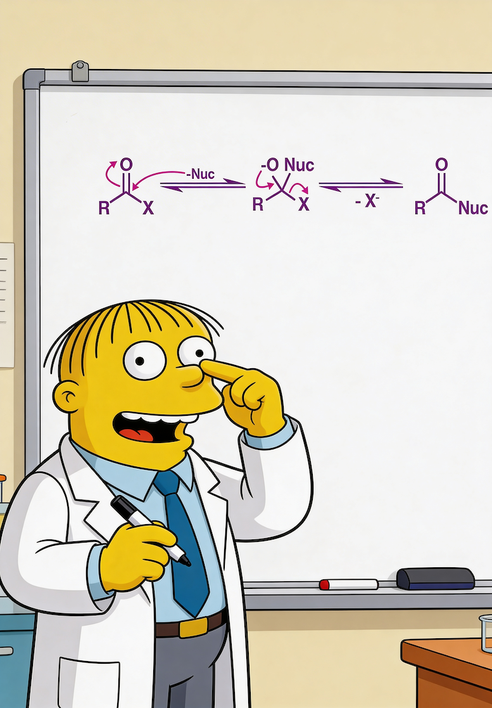
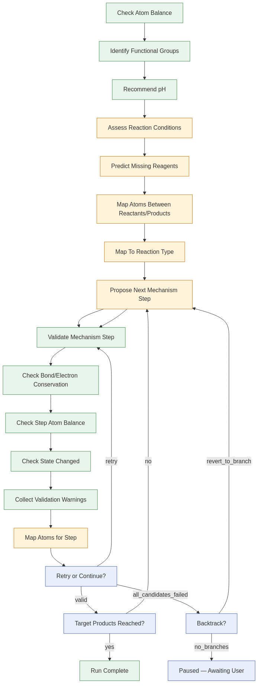

# Mechanistic Curriculum

## Setup

See [SETUP.md](SETUP.md) for installation, environment variables, RDKit, and test instructions.

## Orchestration Modes

RAlph mode provides iterative multi-attempt orchestration with budget controls for enhanced mechanism prediction reliability.

## Program Status

- Course: `Mechanistic Curriculum`
- Launch: `2026-03-11`
- Module: `Module 1` — 1-step reactions

**Trainees:** [anthropic__claude-opus-4-5](skills/mechanistic/propose_mechanism_step/models/anthropic__claude-opus-4-5/)

Quick links: [Checkpoints](curriculum/checkpoints/) | [Reactions](training_data/flower_curriculum_pngs/index.json) | [Prompt guide](docs/model_asset_overrides.md) | [History](docs/history_and_reproducibility.md)

## Current Two-Week Calendar

- [ ] 2026-03-11 Wednesday: Wednesday lesson (lesson scheduled, release `2026-03-11T17:00:00-06:00`)
- [ ] 2026-03-12 Thursday: Thursday lesson (lesson scheduled, release `2026-03-12T17:00:00-06:00`)
- [ ] 2026-03-13 Friday: Friday quiz (quiz scheduled, release `2026-03-13T17:00:00-06:00`)
- [ ] 2026-03-16 Monday: Monday lesson (lesson scheduled, release `2026-03-16T17:00:00-06:00`)
- [ ] 2026-03-17 Tuesday: Tuesday lesson (lesson scheduled, release `2026-03-17T17:00:00-06:00`)
- [ ] 2026-03-18 Wednesday: Wednesday lesson (lesson scheduled, release `2026-03-18T17:00:00-06:00`)
- [ ] 2026-03-19 Thursday: Thursday lesson (lesson scheduled, release `2026-03-19T17:00:00-06:00`)
- [ ] 2026-03-20 Friday: Friday quiz (quiz scheduled, release `2026-03-20T17:00:00-06:00`)
- [ ] 2026-03-23 Monday: Monday lesson (lesson scheduled, release `2026-03-23T17:00:00-06:00`)
- [ ] 2026-03-24 Tuesday: Tuesday lesson (lesson scheduled, release `2026-03-24T17:00:00-06:00`)

## Trainee Progress Snapshot

- [`anthropic__claude-opus-4-5`](skills/mechanistic/propose_mechanism_step/models/anthropic__claude-opus-4-5/) — quality: `—` pass-rate: `—` [leaderboard](curriculum/generated/leaderboard_anthropic__claude-opus-4-5.json)

## Checkpoints

## How to Inspect Any Past Milestone

1. Open the linked checkpoint manifest under `curriculum/checkpoints/`.
2. Check out the recorded git tag or commit.
3. Inspect the manifest for harness metadata plus resolved prompt and few-shot asset hashes.
4. Compare the linked skill directory to the current trainee lane if you want to see prompt or few-shot drift.

---

## Developer

### Harness Workflow Diagram

The default mechanistic harness orchestrates pre-loop analysis, an iterative mechanism-step proposal loop, and post-step validation. The diagram below matches the flow shown in the frontend app's Progress panel:

- **Pre-loop** (runs once): Check Atom Balance -> Identify Functional Groups -> Recommend pH -> Assess Reaction Conditions -> Predict Missing Reagents -> Map Atoms -> Map To Reaction Type
- **Loop**: Propose Next Mechanism Step (LLM) -> Validate Mechanism Step -> Bond/Electron, Atom Balance, State Progress validators -> Retry or Continue? -> Target Products Reached? (yes -> Run Complete; no -> loop back)
- **Decision gates**: Retry/Backtrack routing when validation fails; Paused when no branch points remain

Regenerate the snapshot with `python scripts/capture_harness_mermaid.py`.

### Quick Start

- Start the app: `python main.py serve`
- Submit today’s trainee run: `python main.py curriculum submit --model-name anthropic/claude-opus-4.6`
- Publish queued releases: `python main.py curriculum publish-due`
- Refresh the curriculum dashboard: `python main.py curriculum render-readme`

### Contribution Methods

- Submit an individual reaction locally through the UI or API and use it as evidence for later tracked changes.
- Add or revise few-shot examples for a trainee lane under `skills/mechanistic/<call_name>/models/<model-slug>/few_shot.jsonl`.
- Update prompt instructions in `SKILL.md` for a shared skill or trainee-specific override.
- Propose harness changes under `harness_versions/` and tie them to eval results.
- Add another trainee lane by introducing exact-model overrides and documenting its evidence path.

### Docs

- Operations: [docs/curriculum_operations.md](docs/curriculum_operations.md)
- Prompt/few-shot overrides: [docs/model_asset_overrides.md](docs/model_asset_overrides.md)
- History and reproducibility: [docs/history_and_reproducibility.md](docs/history_and_reproducibility.md)
