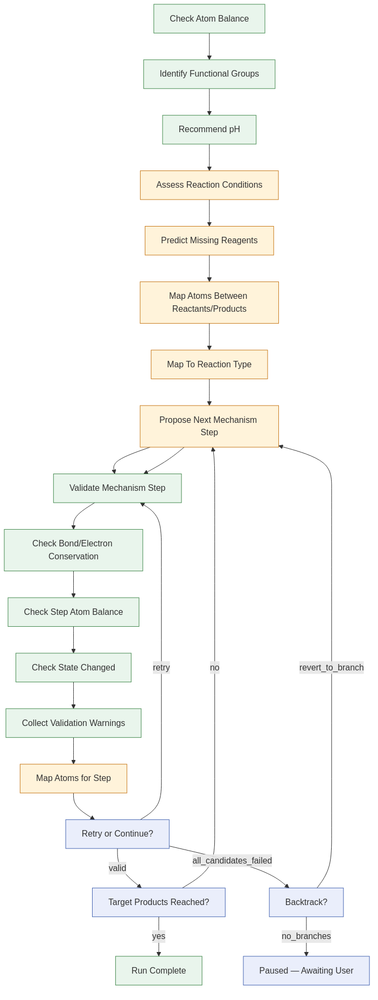
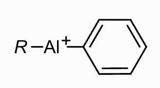

# Mechanistic Curriculum

## Setup

See [SETUP.md](SETUP.md) for installation, environment variables, RDKit, and test instructions. You can also contribute without cloning the repo; see [CONTRIBUTING.md](CONTRIBUTING.md).

## Orchestration Modes

RAlph mode provides iterative multi-attempt orchestration with budget controls for enhanced mechanism prediction reliability.

## Program Status

- Course: `Mechanistic Curriculum`
- Launch: `2026-03-11`
- Module: `Module 1` — 1-step reactions

**Trainees:** [anthropic__claude-opus-4-5](skills/mechanistic/propose_mechanism_step/models/anthropic__claude-opus-4-5/)

Quick links: [Checkpoints](curriculum/checkpoints/) | [Reactions](training_data/flower_curriculum_pngs/index.json) | [Practice eval](training_data/practice_eval/README.md) | [Prompt guide](docs/model_asset_overrides.md) | [History](docs/history_and_reproducibility.md)

## Trainee Progress Snapshot

- [Opus family calendar](curriculum/calendars/opus-4.6.md) — active curriculum for `anthropic/claude-opus-4.6`
- [Sonnet family calendar](curriculum/calendars/sonnet.md) — placeholder, no calendar yet
- [GPT family calendar](curriculum/calendars/gpt.md) — placeholder, no calendar yet
- [Gemini family calendar](curriculum/calendars/gemini.md) — placeholder, no calendar yet

## Checkpoints

## How to Inspect Any Past Milestone

1. Open the linked checkpoint manifest under `curriculum/checkpoints/`.
2. Check out the recorded git tag or commit.
3. Inspect the manifest for harness metadata plus resolved prompt and few-shot asset hashes.
4. Compare the linked skill directory to the current trainee lane if you want to see prompt or few-shot drift.

---

## Developer

### Harness Workflow Diagram

The default mechanistic harness orchestrates pre-loop analysis, an iterative mechanism-step proposal loop, and post-step validation. The diagram below matches the flow shown in the frontend app's Progress panel:

- **Pre-loop** (runs once): Check Atom Balance -> Identify Functional Groups -> Recommend pH -> Assess Reaction Conditions -> Predict Missing Reagents -> Map Atoms -> Map To Reaction Type
- **Loop**: Propose Next Mechanism Step (LLM) -> Validate Mechanism Step -> Bond/Electron, Atom Balance, State Progress validators -> Retry or Continue? -> Target Products Reached? (yes -> Run Complete; no -> loop back)
- **Decision gates**: Retry/Backtrack routing when validation fails; Paused when no branch points remain

Regenerate the snapshot with `python scripts/capture_harness_mermaid.py`.

### Contribution Methods

- See [CONTRIBUTING.md](CONTRIBUTING.md) for the full track definitions, merge gates, and templates.
- Track 5 single-reaction submissions can be done without cloning the repo and are reviewed as evidence for later tracked changes.
- Tracks 1 through 4 are the mergeable paths for few-shot updates, subagents, model additions, and harness changes, and will usually require a git clone plus local test/eval runs.
- If you want attribution in future manuscript notes or acknowledgements, include the optional contact fields requested in the contribution templates.

### Docs

- Operations: [docs/curriculum_operations.md](docs/curriculum_operations.md)
- Prompt/few-shot overrides: [docs/model_asset_overrides.md](docs/model_asset_overrides.md)
- History and reproducibility: [docs/history_and_reproducibility.md](docs/history_and_reproducibility.md)
- Project philosophy: [SOUL.md](SOUL.md)

## RAlph Mode

Use the RAlph mode option when you want the harness to spend more budget on iterative retries and candidate selection instead of taking a single straight-through attempt.
