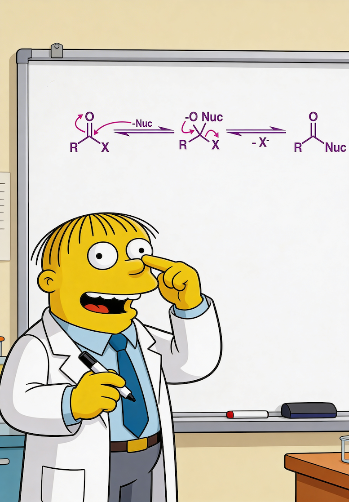
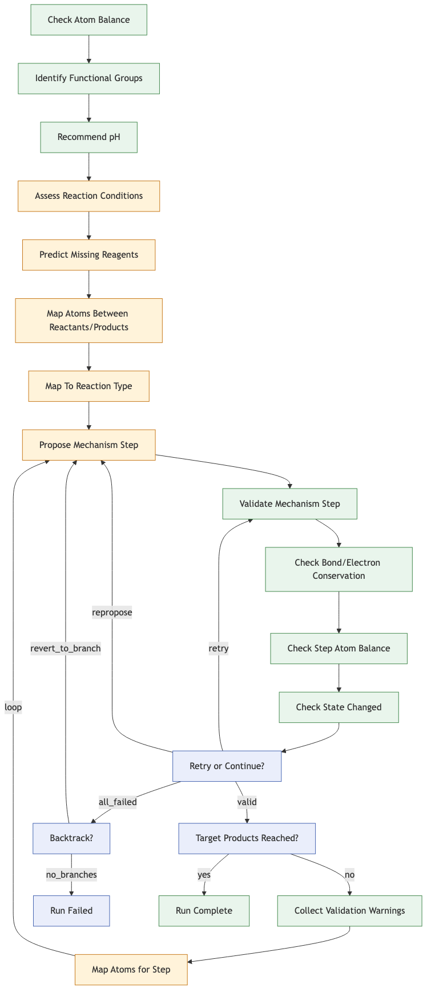

# Mechanistic Curriculum

## Orchestration Modes

RAlph mode provides iterative multi-attempt orchestration with budget controls for enhanced mechanism prediction reliability.

## Program Status

- Course: `Mechanistic Curriculum`
- Launch: `2026-03-11`
- Module: `Module 1` — 1-step reactions

**Trainees:** [anthropic__claude-opus-4-5](skills/mechanistic/propose_mechanism_step/models/anthropic__claude-opus-4-5/) | [anthropic__claude-opus-4.6](skills/mechanistic/propose_mechanism_step/models/anthropic__claude-opus-4.6/)

Quick links: [Checkpoints](curriculum/checkpoints/) | [Reactions](training_data/flower_curriculum_pngs/index.json) | [Prompt guide](docs/model_asset_overrides.md) | [History](docs/history_and_reproducibility.md)

Curriculum checkpoints and trainee lanes advance **as time permits**. There is no public release clock; use the CLI below when you are ready to queue or publish work.

## Trainee Progress Snapshot

- Trainee: `Claude Opus` — [leaderboard](curriculum/generated/leaderboard_anthropic_claude-opus-4.6.json)
- Mean quality: `0.998`
- Pass rate: `100.0%`
- Cases: `4`
- Run group: `curriculum_default_s1_r47_n4`

## Checkpoints

## How to Inspect Any Past Milestone

1. Open the linked checkpoint manifest under `curriculum/checkpoints/`.
2. Check out the recorded git tag or commit.
3. Inspect the manifest for harness metadata plus resolved prompt and few-shot asset hashes.
4. Compare the linked skill directory to the current trainee lane if you want to see prompt or few-shot drift.

---

## Developer

### Harness Workflow Diagram

The default mechanistic harness orchestrates pre-loop analysis, an iterative mechanism-step proposal loop, and post-step validation. The diagram below matches the flow shown in the frontend app's Progress panel:

- **Pre-loop** (runs once): Check Atom Balance -> Identify Functional Groups -> Recommend pH -> Assess Reaction Conditions -> Predict Missing Reagents -> Map Atoms -> Map To Reaction Type
- **Loop**: Propose Next Mechanism Step (LLM) -> Validate Mechanism Step -> Bond/Electron, Atom Balance, State Progress validators -> Retry or Continue? -> Target Products Reached? (yes -> Run Complete; no -> loop back)
- **Decision gates**: Retry/Backtrack routing when validation fails; Paused when no branch points remain

Regenerate the diagram with `python scripts/capture_harness_mermaid.py` (writes docs/diagrams/Harness_Configuration_Flowchart.mmd and .png).

### Quick Start

- Start the app: `python main.py serve`
- Queue a trainee curriculum batch when ready: `python main.py curriculum submit --model-name anthropic/claude-opus-4.6`
- Publish a queued batch when ready: `python main.py curriculum publish --checkpoint-id <queue-id>` (add `--force` to skip any stored publish timestamp)
- Optionally publish every queued batch whose timestamp has passed: `python main.py curriculum publish-due`
- Refresh this README and `curriculum/generated/`: `python main.py curriculum render-readme`
- Optional: `python main.py curriculum install-launchd` writes a sample plist if you automate `publish-due` locally

### Contribution Methods

- Submit an individual reaction locally through the UI or API and use it as evidence for later tracked changes.
- Add or revise few-shot examples for a trainee lane under `skills/mechanistic/<call_name>/models/<model-slug>/few_shot.jsonl`.
- Update prompt instructions in `SKILL.md` for a shared skill or trainee-specific override.
- Propose harness changes under `harness_versions/` and tie them to eval results.
- Add another trainee lane by introducing exact-model overrides and documenting its evidence path.

### Docs

- Prompt/few-shot overrides: [docs/model_asset_overrides.md](docs/model_asset_overrides.md)
- History and reproducibility: [docs/history_and_reproducibility.md](docs/history_and_reproducibility.md)
