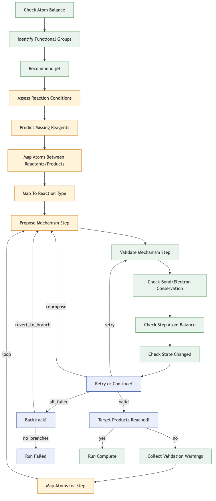

# Professor Wiggum — Mechanistic Agent


A local-first agent that predicts **arrow-pushing (elementary-step) mechanisms** for organic reactions. An LLM proposes each step; deterministic RDKit validators (bond/electron conservation, atom balance, state progress) decide whether the step is accepted. The harness — prompts, few-shots, module graph, validators — evolves only on eval evidence. See [SOUL.md](SOUL.md) for the philosophy.

## Leaderboard

We are focusing on one top-tier model — currently **Claude Opus 5.5** — to improve the harness, and will back-fill cheaper models later. Scores are the 1000-point eval rubric on FlowER-derived tiers of 10 cases each (easy = 1–2 steps, medium = 3, hard = 4–8; WIN ≥ 700).

<!-- leaderboard:start -->
| Tier | Best model | Score | Targets reached | Passed | Harness | Date | Details |
|---|---|---|---|---|---|---|---|
| easy | **Claude Opus 5.5** | **940**/1000 | 10/10 | 10/10 | `default` | 2026-09-29 | [results](LEADERBOARD.md#2026-09-29-cli-eval-opus55-easy) |
| medium | **Claude Opus 5.5** † | **904**/1000 | 10/10 | 10/10 | `jev_reaction_type` | 2026-09-29 | [results](LEADERBOARD.md#2026-09-29-bridge-opus55-jev-medium) |
| hard | **Claude Opus 5.5** † | **823**/1000 | 10/10 | 9/10 | `jev_reaction_type` | 2026-09-29 | [results](LEADERBOARD.md#2026-09-29-bridge-opus55-jev-hard) |

Hardest mechanism solved so far: [`flower_002647`, a 4-step mechanism (hard tier, Claude Opus 5.5)](results/mechanisms/bridge_opus55_jev_hard__flower_002647.png). Full results: [LEADERBOARD.md](LEADERBOARD.md).

† Answered through the [agent bridge](docs/agent_bridge.md): each model call went to the declared model in a fresh session that saw only the harness prompt (`responder_saw_ground_truth: false`). Cost is opaque, so these rows make no cost claim.
<!-- leaderboard:end -->

## Run types

All results land in the local SQLite database (`../wiggum-data/data/mechanistic.db` when the sibling data checkout exists; see [docs/DATA_SETUP.md](docs/DATA_SETUP.md)). Nothing reaches git until you publish it with `publish-results`.

| Run type | Invoke | Leaderboard |
|---|---|---|
| Single reaction | `python main.py run --starting "CCO" --products "CC=O"` (add `--mode verified` to submit your own steps) | none |
| Web UI | `python main.py serve` → `http://127.0.0.1:8010/` (unverified mode only; `/?run=<id>` replays a run) | none |
| Harness dev eval | `python main.py eval --tier easy\|medium\|hard --model <id> [--harness <name>]` or `--all-tiers` | development leaderboard (local): `python main.py leaderboard --eval-set-id <id>`, UI, `GET /api/evals/leaderboard` |
| Harness-free baseline | `python main.py baseline --tier <tier> --model <id>` (or `--all-tiers`) | development leaderboard, type `Baseline` |
| Official holdout | `python main.py eval-runset-official --model-name <id>` and `baseline-runset-official` | official leaderboard: `python main.py leaderboard-official`; `update-leaderboard-artifacts` refreshes the [legacy Arena table](docs/legacy/clawdiators_leaderboard.md) |
| Publish results | `python main.py publish-results --eval-run-id <id> [--open-pr]`, or `eval ... --publish [--open-pr]` | public [LEADERBOARD.md](LEADERBOARD.md) and the board above, from committed `results/runs/*.json` |
| Keyless (agent bridge) | any of the above with `--model agent-bridge`, answered by `python main.py bridge-serve --command "<responder>"` | same leaderboards, model column `agent-bridge` † |
| Curriculum checkpoints | `python main.py curriculum submit\|publish\|render-readme --model-name <id>` | `curriculum/generated/leaderboard_*.json`, [curriculum/STATUS.md](curriculum/STATUS.md) |
| Harness evolution | `python scripts/evolve_harness.py [--island-mode]`, `python main.py overnight-ralph`, `python main.py vote` | evolution archive (holdout sets are rejected) |

Notes:
- `eval --tier` goes through the development-leaderboard planner, which may re-route a run (for example to repeat the current tier). Pass `--leaderboard-route next` to move up a tier or `custom` to keep your own selection; see [docs/development_leaderboard_routes.md](docs/development_leaderboard_routes.md).
- `publish-results` exports an eval run to `results/runs/` (scores, per-case table, the hardest mechanism solved as an image) and regenerates `LEADERBOARD.md` and the board above. `--open-pr` branches from `origin/main`, commits only those files, and opens a PR; it never merges. Ground-truth replays are refused, and holdout runs publish aggregates only.
- Leaderboards drop eval runs whose responder declares it saw the ground truth.
- Custom eval sets without FlowER data: [docs/custom_eval_sets.md](docs/custom_eval_sets.md). Keyless runs: [docs/agent_bridge.md](docs/agent_bridge.md).

## Contributing

There are three ways to contribute (details in [CONTRIBUTING.md](CONTRIBUTING.md)):

1. **Report a chemistry problem** — open a *Chemistry failure* issue with the starting materials, products, and what went wrong. That alone is a complete contribution.
2. **Report a bug or idea** — open a *Bug report* or *Feature request* issue.
3. **Submit code** — PRs are welcome; the only check you need is `python -m pytest tests/fast/ -q`.

Changes to prompts, few-shots, models, validators, or harness behaviour are evidence-gated by the maintainers before merge ([docs/change_evidence_policy.md](docs/change_evidence_policy.md)); you do not need to run model evals yourself. If you work through an agent with no API key, you can still produce runs and traces via the [agent bridge](docs/agent_bridge.md) — declare the responder's origin and ground-truth exposure so the runs can be used as evidence. To share a result, run `python main.py publish-results --eval-run-id <id> --open-pr`. Maintainer playbooks: [docs/agent_playbooks.md](docs/agent_playbooks.md).

## Developer

### Quick start

```bash
python -m venv .venv && source .venv/bin/activate
pip install -r requirements.txt && pip install -e . --no-deps
python -m pytest tests/fast/ -q
python main.py serve
```

Full setup: [SETUP.md](SETUP.md). Data layout (sibling `wiggum-data` checkout or in-repo fallback): [docs/DATA_SETUP.md](docs/DATA_SETUP.md). Runtime architecture, endpoints, and conventions: [AGENTS.md](AGENTS.md).

### Harness workflow



- **Pre-loop** (runs once): check atom balance → identify functional groups → recommend pH → assess conditions → predict missing reagents → map atoms → map to reaction type (LLM, or a Jev decision in the `jev_reaction_type` harness)
- **Loop**: propose next mechanism step (LLM) → bond/electron, atom-balance, and state-progress validators → retry, backtrack, or continue → target products reached? A step whose only failure is atom balance is accepted with a flag (`balance_mode: deferred`) rather than rejected.
- **Post-loop**: the mechanism audit nets out the chosen path — regenerated catalysts, conjugate acid/base pairs, proton bookkeeping, recorded reagent additions — resolves each balance flag or fails the case, and reports redundant steps (undo steps, repeated states, mergeable proton transfers)

Harness variants live under `harness_versions/` (`default`, `jev_reaction_type`, `permissive_default`, ablations). Regenerate the diagram with `python scripts/capture_harness_mermaid.py`.

### Docs

- Prompt/few-shot overrides: [docs/model_asset_overrides.md](docs/model_asset_overrides.md)
- History and reproducibility: [docs/history_and_reproducibility.md](docs/history_and_reproducibility.md)
- Evidence policy: [docs/change_evidence_policy.md](docs/change_evidence_policy.md)
- Curriculum lanes and checkpoints: [curriculum/STATUS.md](curriculum/STATUS.md)

The 1000-point rubric originated with the Clawdiators arena; that material is kept in [docs/legacy/clawdiators_leaderboard.md](docs/legacy/clawdiators_leaderboard.md).
