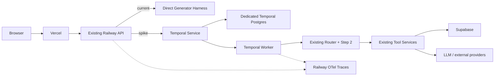

---

Product: ChemIllusion / chem-art-generator
Status: Proposed — spike only; no production routing changed, no Temporal service deployed, no migrations applied
Date: 2026-09-22
Surfaces: Generator router-first harness first; selected agent harnesses only after a separate go/no-go decision
Last verified against main: `0c409a42c4e7256e6a0a1c0975b60756d1ef99f5`
----------------------------------------------------------------------

# PRD: Temporal-on-Railway Agent Harness Spike

## 1. Summary

ChemIllusion should run a bounded **Temporal-on-Railway spike** to determine whether durable workflow orchestration improves the reliability and operability of the Generator-page agent harness enough to justify broader adoption.

This is an experiment, not a platform migration.

The spike will:

1. Deploy a self-hosted Temporal Service on Railway using private networking.
2. Deploy a separate ChemIllusion Temporal Worker on Railway.
3. Use dedicated PostgreSQL persistence for Temporal rather than the ChemIllusion application database.
4. Add a feature-gated Temporal execution backend beneath the existing Generator router-first harness.
5. Run the current ChemIllusion agent-evaluation corpus through both the direct and Temporal paths.
6. Inject worker, process, provider, and post-side-effect failures.
7. Measure behavioral accuracy, execution correctness, latency, LLM/provider cost, Railway infrastructure cost, retry amplification, and operational burden.
8. Produce a written go/no-go report before Temporal is considered for additional services or harnesses.

Temporal must sit **under** the current harness. It does not replace `LLMToolRouterService`, `Step2ExecutorService`, tool schemas, Goal Mode, working memory, chemistry validation, billing policy, or canonical chat history.

The first spike uses:

```text
one Generator turn = one Temporal Workflow
```

rather than one long-lived Temporal Workflow per Generator project.

A successful result does not imply “Temporal everywhere.” The expected long-term architecture, if the spike succeeds, may be mixed:

```text
router-first harness
        |
        +--> direct execution
        |      cheap / immediate / reversible work
        |
        +--> Temporal execution
               multi-stage / costly / side-effecting /
               cancellable / failure-sensitive work
```

---

## 2. Current-State Basis

The following observations were confirmed against the repository rather than inferred from earlier plans.

| Existing file                                            | Confirmed observation                                                                                                                                                                                         | Consequence                                                                                                          |
| -------------------------------------------------------- | ------------------------------------------------------------------------------------------------------------------------------------------------------------------------------------------------------------- | -------------------------------------------------------------------------------------------------------------------- |
| `wiki/pages/17-agent-harness-architecture.md`            | ChemIllusion has roughly twenty distinct agent loops sharing a common substrate. Generator chat is a `router_tool` harness with 13 tools, working memory, Goal Mode, and currently client-abort cancellation. | Temporal must extend the shared architecture rather than replace it. Generator is a useful first adopter.            |
| `backend/app/services/intent_gate_service.py`            | Trivial and undo turns can short-circuit before model routing.                                                                                                                                                | Do not send already-resolved trivial turns through Temporal during the spike.                                        |
| `backend/app/services/llm_tool_router_service.py`        | Step 1 chooses exactly one tool/schema and emits no user-facing prose.                                                                                                                                        | Step 1 is a natural Activity boundary.                                                                               |
| `backend/app/services/step2_executor_service.py`         | Step 2 forces the selected tool schema. It already supports provider-specific execution and a separate OpenAI `DurableRun` concept.                                                                           | Temporal orchestrates application execution; it must not duplicate or conflate provider-level durability.            |
| `backend/app/services/canvas_harness/`                   | Canvas snapshots, action registry, schemas, modes and lints already structure Generator execution.                                                                                                            | Reuse these unchanged so the spike measures orchestration rather than redesigned prompts/tools.                      |
| `backend/app/agent_core/harness/manifest.py`             | `HarnessManifest` declares execution kind, toolset, memory/context, cancellation, Goal Mode and privacy. `agent_core` is intentionally boundary-clean.                                                        | Keep Temporal out of `agent_core` during the spike.                                                                  |
| `wiki/pages/22-agent-evaluation-harnesses.md`            | Existing test infrastructure already drives the real router, seeds realistic Ketcher canvases, exercises the HTTP Generator path and uses an LLM evaluator.                                                   | Extend this system for the Temporal benchmark instead of inventing a second evaluation framework.                    |
| `backend/scripts/test_chat_agent.py`                     | The repo already supports per-tool/per-model testing with multiple samples and high-capability evaluation.                                                                                                    | Reuse its cases and reporting inputs.                                                                                |
| `backend/scripts/router_parity_shadow.py`                | A paired/shadow parity testing pattern already exists.                                                                                                                                                        | Follow the same candidate-vs-current philosophy.                                                                     |
| `wiki/pages/02-deployment-and-request-topology.md`       | Vercel fronts application traffic; Railway handles AI/application logic and persistent workflows; Supabase handles application persistence/storage.                                                           | Temporal belongs on Railway and should not be exposed through Vercel.                                                |
| `railway.json`                                           | The existing Railway service builds `backend/Dockerfile.api`, runs migration setup and health-checks the API.                                                                                                 | Do not turn the API service itself into a Temporal server.                                                           |
| `backend/app/services/ai_action_billing_service.py`      | AI-action deduction mutates balances and commits directly; row locking and reservation/release helpers exist. A turn-level retry-deduplication contract was not verified.                                     | Paid-user Temporal traffic is blocked until billing settlement is proven idempotent.                                 |
| `AGENTS_PART_5.md`                                       | `SessionMetric` stores product/session behavior, not execution traces.                                                                                                                                        | Temporal does not replace Session Metrics.                                                                           |
| `docs/chemillusion_scale_hardening_prd.md`               | Current durable-workload architecture deliberately starts with a PostgreSQL-backed job ledger rather than a new workflow framework.                                                                           | This PRD tests whether selected agent orchestration deserves an exception; it does not silently supersede that plan. |
| `docs/chemillusion_responses_api_harness_runtime_prd.md` | Current Responses work keeps normal Step 1/Step 2 foreground while adding selected provider-level background execution.                                                                                       | Temporal is explicitly a spike against that assumption, not an unnoticed architecture change.                        |

### External basis

Temporal Server is MIT-licensed and supports self-hosting. Railway supports private service-to-service networking, making it possible to keep Temporal off the public internet. Railway also now accepts OpenTelemetry spans into its tracing system, which gives this spike an existing observability backend rather than requiring Grafana/Honeycomb/Datadog.

Current external versions and Railway prices must be rechecked immediately before deployment rather than permanently encoded in the architecture.

---

## 3. Relationship to Existing Architecture

### 3.1 Router-first remains mandatory

Temporal may orchestrate:

```text
Intent Gate
    ↓
Step 1 Router
    ↓
Step 2 Forced Executor
    ↓
Tool Execution
    ↓
Persistence / Billing / Result
```

Temporal must not:

* bypass Step 1;
* independently choose a tool;
* reuse stale tool authority from an earlier turn;
* change Step 2 schemas;
* turn Workflow history into semantic memory;
* move provider/model-selection policy into Workflow code.

### 3.2 Scale-hardening PRD remains authoritative

`docs/chemillusion_scale_hardening_prd.md` currently specifies a Postgres-backed durable job system for heavyweight creator/background work.

This spike does not replace that architecture.

If Temporal later proves superior for deck generation, render jobs, CourseHouse or other workloads already covered there, write an explicit amendment describing which portions are superseded.

### 3.3 OpenAI `DurableRun` is different

Keep these concepts separate:

```text
Temporal Workflow
    application-level execution durability

OpenAI DurableRun
    provider-response lifecycle / cancellation
```

A Temporal Activity may call the existing Step 2 runtime and therefore indirectly use `DurableRun`, but IDs, retries, cancellation and telemetry must remain distinct.

### 3.4 Keep `agent_core` clean

Do not add Temporal, Railway, database, billing or configuration imports under:

```text
backend/app/agent_core/
```

Any eventual generic durability abstraction belongs at the interface/policy level. The concrete Temporal implementation remains application infrastructure.

---

## 4. Problem

A Generator turn can now include:

```text
canvas state
→ intent gate
→ Step 1 routing
→ working-memory context
→ Goal Mode policy
→ forced Step 2 call
→ canvas lint/retry
→ external provider calls
→ chemistry/tool execution
→ artifact creation
→ project/canvas persistence
→ billing
→ result normalization
```

This is no longer equivalent to disposable conversational text generation.

Failures can occur between meaningful side effects. A worker/process failure after an artifact is created but before completion is recorded creates ambiguity:

* Was the provider already charged?
* Was an AI Action already deducted?
* Was an artifact already persisted?
* Should the LLM be called again?
* Will a retry duplicate a canvas object?
* Which state is authoritative after a restart?

Before introducing a workflow engine broadly, ChemIllusion needs measured answers to four questions:

**Correctness:** Does Temporal preserve current agent behavior?

**Reliability:** Does Temporal materially improve recovery without introducing duplicate effects?

**Latency:** Is Workflow scheduling overhead acceptable for interactive Generator use?

**Cost:** Do the reliability benefits justify another Railway service, database, worker and retry-related provider consumption?

---

## 5. Goals

1. Run Temporal privately on Railway.
2. Preserve current Generator router/tool behavior.
3. Measure direct-vs-Temporal quality with the existing evaluation corpus.
4. Separate LLM-quality parity from execution/recovery correctness.
5. Measure p50/p95/p99 orchestration latency.
6. Measure provider cost per successful turn.
7. Measure actual Railway cost attributable to Temporal.
8. Quantify retry-driven duplicate provider calls.
9. Prove or disprove idempotency for billing, artifacts and canvas mutation.
10. Produce a scoped adoption decision rather than assuming all harnesses should migrate.

---

## 6. Non-Goals

This spike does not:

* migrate all agent harnesses;
* replace router-first;
* replace Goal Mode;
* replace canonical transcripts;
* replace working or semantic memory;
* replace `SessionMetric`;
* replace OpenTelemetry;
* replace Supabase;
* replace the existing durable-job plan;
* change models/prompts to improve benchmark results;
* expose Temporal publicly;
* move ZDR, ELN-private, LMS-sensitive or Live Voice traffic to Temporal;
* create a long-lived Workflow for every project;
* automatically change Generator cancellation semantics;
* apply migrations without Scott's approval.

---

## 7. Target Railway Architecture

A meaningful self-hosted deployment requires three components, even though we refer to it collectively as the Temporal Railway service.

| Railway component       | Purpose                                      | Public endpoint |
| ----------------------- | -------------------------------------------- | --------------- |
| `temporal-spike-server` | Temporal Service                             | No              |
| `temporal-spike-db`     | Dedicated Temporal PostgreSQL                | No              |
| `temporal-spike-worker` | ChemIllusion Python Workflow/Activity Worker | No              |

The existing API remains the application entry point.



### 7.1 Private networking

Use only Railway's private DNS:

```text
TEMPORAL_ADDRESS=temporal-spike-server.railway.internal:7233
```

Do not create:

```text
public Railway domain
public TCP proxy
Vercel proxy route
public Temporal Web UI
```

### 7.2 Persistence

Temporal gets its own Postgres instance.

Do not use the ChemIllusion Supabase application schema for Temporal internals.

Temporal schema upgrades are infrastructure operations, not ChemIllusion Alembic migrations.

### 7.3 Version pinning

During Phase 0:

```text
pin Temporal Server image
pin temporalio Python SDK
record both in the experiment report
```

Do not depend on `latest`.

---

## 8. Workflow Design

### 8.1 One turn per Workflow

First-spike Workflow identity:

```text
generator-turn:{turn_id}
```

This makes duplicate HTTP submission naturally testable.

Do not begin with:

```text
generator-project:{project_id}
```

A project-scoped Workflow remains a future option for Signals/Updates, cross-turn operational state and true session-level cancellation.

### 8.2 Workflow responsibilities

Workflow code controls ordering only.

Illustrative structure:

```python
@workflow.defn
class GeneratorTurnWorkflow:

    @workflow.run
    async def run(self, request: GeneratorTurnInput):

        route = await workflow.execute_activity(
            route_turn_activity,
            request,
            ...
        )

        step2 = await workflow.execute_activity(
            execute_step2_activity,
            Step2Input.from_route(route),
            ...
        )

        result = await workflow.execute_activity(
            execute_tool_activity,
            ToolInput.from_step2(step2),
            ...
        )

        return await workflow.execute_activity(
            finalize_turn_activity,
            FinalizeInput(...),
            ...
        )
```

Workflow code must not directly:

```text
open SQLAlchemy sessions
call LLM providers
call Supabase
mutate billing
write files
perform external HTTP requests
read changing environment state
```

Those belong in Activities.

### 8.3 Cheap short-circuits

Keep the existing Intent Gate before Temporal admission where it conclusively answers the request.

There is little value in scheduling a Workflow to perform work the current gate already resolves deterministically.

The benchmark must report short-circuit counts.

---

## 9. Feature Control

Use a temporary dark-launch flag because this changes execution semantics:

```text
TEMPORAL_HARNESS_SPIKE_MODE=off|benchmark|canary
TEMPORAL_HARNESS_SPIKE_SURFACES=generator_chat
```

Behavior:

```text
off
    existing production behavior

benchmark
    test/internal execution only

canary
    explicitly eligible admin/test requests
```

Do not percentage-rollout during the first spike.

### Flag cleanup

After the decision:

**Rejected:** delete the Temporal spike code/flags.

**Selective adoption:** replace them with a real execution-policy abstraction.

**Broader adoption:** migrate deliberately and still delete the spike flag.

A permanently enabled `TEMPORAL_HARNESS_SPIKE_*` variable is not an acceptable final state.

---

## 10. Workload Selection

### 10.1 All-tool parity

Run existing Generator evaluation cases across all current Generator tools.

This measures:

```text
router choice
tool-equivalent choice
Step 2 schema validity
Goal Mode behavior
evaluator findings
latency
```

### 10.2 Recovery subset

Select four representative execution classes:

```text
canvas_control
one artifact-producing Generator tool
one relatively expensive/multi-stage tool
one cheap deterministic control operation
```

Select the latter three from the current registry at implementation time rather than freezing names in this PRD.

---

## 11. Functional Requirements

### FR-1 — Isolation

Temporal Server, Temporal Postgres and the ChemIllusion Worker are independent Railway services/resources.

The normal API remains healthy when Temporal is disabled.

### FR-2 — Existing harness stays authoritative

Temporal Activities call the current:

```text
LLMToolRouterService
Step2ExecutorService
tool execution services
canvas harness
persistence services
```

Do not build another tool registry.

### FR-3 — Stable turn identity

Every candidate request gets a stable `turn_id`.

The same accepted `turn_id` maps to the same Workflow ID.

A repeated request must reconnect to/retrieve the existing execution or fail with a deterministic conflict if the canonical input is different.

It must not create a second logical turn.

### FR-4 — Explicit retries

Define retry policy separately for:

```text
Step 1 LLM
Step 2 LLM
external provider tool
deterministic/local tool
persistence
billing settlement
```

Validation, authentication, entitlement and other permanent failures are not retryable.

### FR-5 — Measure LLM retry amplification

A crash can occur after a provider returns but before the Activity result is acknowledged.

Therefore report:

```text
provider calls / logical turn
provider calls / successful turn
provider cost / successful turn
provider calls caused by Temporal retry
```

Do not describe Temporal as automatically delivering exactly-once external side effects.

### FR-6 — Idempotent side-effect contract

Before real-user canary, every retriable user-visible effect requires:

```text
operation_key =
    {turn_id}:{stage}:{logical_effect}
```

On retry, the application must either:

```text
return the existing effect/result
```

or:

```text
safely create the effect once
```

This applies to:

```text
AI-action billing
artifact creation
canvas/project persistence
tool-result persistence
```

### FR-7 — Billing canary gate

Current billing was not verified as turn-idempotent.

Therefore:

1. benchmark with admin/test or otherwise non-consumptive accounts;
2. record expected charge separately;
3. do not send paid users through Temporal until billing replay safety is implemented or verified;
4. if a new effect ledger is required, use additive-only schema and separate RLS migrations;
5. write migrations but do not apply them until Scott approves.

### FR-8 — Avoid unnecessary application schema during benchmark

Use:

```text
Temporal history
Railway traces
test result artifacts
existing chat/cost records
```

for the first benchmark.

Do not create a new table merely to mirror Temporal Workflow status.

### FR-9 — Cancellation semantics remain explicit

Distinguish:

```text
browser/client abort
Temporal Workflow cancel
Activity cancellation
provider cancellation
```

Do not update the Generator manifest from `client_abort` until a complete cancellation path is actually verified.

### FR-10 — OpenTelemetry

Emit spans including:

```text
generator.turn
generator.temporal.start
generator.route
generator.step2
generator.tool
generator.persist
generator.billing
generator.temporal.wait
```

Safe attributes:

```text
execution.backend
surface
tool.name
test_run_id
workflow_id
workflow_run_id
attempt
outcome
```

Do not attach:

```text
raw prompts
full canvas contents
emails
auth headers
API keys
uploaded documents
private molecule data by default
```

### FR-11 — Session Metrics remain separate

Do not store Temporal histories in `SessionMetric`.

If later useful, record only something small such as:

```text
execution_backend=direct|temporal
```

through the existing analytics pipeline.

### FR-12 — Benchmark execution selector

Support:

```text
direct
temporal
paired
```

in either `test_chat_agent.py` or a sibling spike runner.

### FR-13 — Identical paired inputs

Direct and Temporal comparison runs must use the same:

```text
prompt
model tier
tool universe
canvas fixture
selection state
history/context
working-memory digest
relevant feature flags
```

### FR-14 — Two comparison modes

#### Live parity

Both paths independently execute the complete router/Step 2/tool sequence.

This catches accidental prompt/context/runtime divergence.

#### Replay execution

Capture a validated routing/Step 2 result once and exercise the downstream orchestration separately.

This isolates Temporal execution correctness from LLM stochasticity.

### FR-15 — Fault injection

Test-only named failure points:

```text
after_workflow_started
before_router_activity_complete
after_router_activity_complete
after_step2_provider_return
before_tool_side_effect
after_tool_side_effect_before_activity_ack
before_persist_commit
after_persist_commit_before_activity_ack
before_billing
after_billing_before_activity_ack
```

Normal production requests must not be able to activate fault injection.

### FR-16 — Worker restart

A Railway worker termination/redeployment after Workflow admission must produce:

```text
successful resumed completion
```

or:

```text
explicit terminal failure after retry policy
```

Never permanent `running`.

### FR-17 — Duplicate submission

Submitting the same logical `turn_id` repeatedly must produce:

```text
1 Workflow
1 canonical result
<= 1 logical artifact/canvas effect
<= 1 logical billing effect
```

### FR-18 — Temporal outage cases

Measure:

```text
Temporal unavailable before admission
Temporal unavailable after admission
worker unavailable
Temporal DB restart
```

The API must distinguish:

```text
not admitted
```

from:

```text
admitted and awaiting execution/recovery
```

### FR-19 — Railway cost attribution

Capture actual Railway usage independently for:

```text
temporal-spike-server
temporal-spike-db
temporal-spike-worker
```

### FR-20 — Provider cost attribution

Report independently:

```text
direct baseline provider cost
Temporal no-fault provider cost
Temporal fault-run provider cost
retry-amplification provider cost
LLM evaluator cost
```

### FR-21 — Prevent preview-environment duplication

Do not automatically clone the Temporal server/database/worker for every PR preview.

### FR-22 — No Temporal UI initially

Use Temporal CLI/API plus Railway traces during the spike.

A private UI is a later operational decision.

---

## 12. Data/API Shape

### Workflow input

Prefer identifiers that allow an Activity to reconstruct canonical state:

```python
class GeneratorTurnInput:
    turn_id: str
    conversation_uuid: str | None
    project_id: int | None
    user_id: int
    model_tier: str
    surface: str = "generator_chat"
    test_run_id: str | None = None
```

Avoid putting large prompts, conversations or canvas JSON directly into Workflow history when practical.

### Workflow result

```python
class GeneratorTurnResult:
    turn_id: str
    workflow_id: str
    workflow_run_id: str
    selected_tool: str | None
    outcome: str
    tool_result_ref: str | None
    attempts: dict[str, int]
    timing_ms: dict[str, float]
```

Large outputs remain in existing storage/application records.

### API execution seam

Conceptually:

```python
if execution_backend == "direct":
    return await run_existing_generator_turn(...)

if execution_backend == "temporal":
    return await temporal_generator_turn_service.execute(...)
```

Do not change the browser-facing API contract merely to conduct the benchmark.

---

## 13. Optional Effect Ledger

If current application records cannot provide retry-safe side effects, add a narrow ledger only before canary.

Example:

```text
harness_execution_effects

id
turn_id
effect_key
effect_type
status
result_ref
created_at
completed_at
```

Unique:

```text
(turn_id, effect_key)
```

Migration rules:

```text
additive only
schema migration separate from RLS
written but unapplied until Scott approves
no drops
no renames
```

---

## 14. Accuracy Measurement

Temporal should not make the model smarter.

The quality target is **parity**.

The reliability target is **improvement under failure**.

### Existing infrastructure

Reuse:

```text
chat_test_case_service.py
chat_test_canvas_fixtures.py
chat_test_harness_service.py
generator_chat_test_service.py
chat_test_evaluator_service.py
chat_test_infrastructure_errors.py
chat_test_results_service.py
chat_test_report_service.py
test_chat_agent.py
```

The current evaluator already distinguishes agent failures from infrastructure failures and accepts legitimate tool equivalents. That is preferable to inventing a new Temporal-specific judge.

### Initial decision-quality population

Target:

```text
13 Generator tools
× 10 cases/tool/path
× 2 execution paths
= 260 live executions
```

If the validated corpus cannot supply 10 cases for a tool, use the full valid set and record `n`.

### Metrics

| Metric                   | Meaning                                               |
| ------------------------ | ----------------------------------------------------- |
| Expected-tool accuracy   | Router selects nominal expected tool                  |
| Tool-equivalent accuracy | Router selects expected or accepted equivalent        |
| Step 2 validity          | Forced output satisfies tool schema                   |
| Tool success             | Application tool completes                            |
| Canvas/result validity   | Existing deterministic lints/validation pass          |
| Evaluator critical rate  | Existing evaluator emits `critical`                   |
| Evaluator warning rate   | Existing evaluator emits `warning`                    |
| Goal Mode parity         | Detection/action-estimate behavior remains equivalent |

### Provisional quality gate

Temporal passes behavioral parity if:

```text
tool-equivalent accuracy degradation <= 1 percentage point

Step 2 schema-valid degradation <= 1 percentage point

no new systematic critical evaluator finding

Goal Mode behavior unchanged
```

If sample size is too small to meaningfully resolve a one-point difference, report uncertainty rather than forcing a pass.

---

## 15. Reliability Measurement

Report:

```text
logical turns admitted
Workflows completed
Workflows terminal-failed
Workflows recovered after fault
duplicate provider calls
duplicate tool effects
duplicate canvas changes
duplicate artifacts
duplicate billing effects
manual interventions
```

### Reliability gate

For injected recoverable failures:

```text
100% reach completion or explicit terminal state
0 permanently stuck Workflows
0 duplicate user-visible effects for canary
0 duplicate billing effects for paid canary
```

Provider-call duplication may occur during the benchmark, but it must be measured.

---

## 16. Latency Measurement

Capture:

```text
request → Workflow admission
admission → first Workflow Task
Activity queue wait
Step 1
Step 2
tool execution
persistence
Workflow completion → API response
total end-to-end
```

Report:

```text
p50
p95
p99
```

for:

```text
direct no-fault
Temporal no-fault
Temporal recovered
```

### Provisional interactive threshold

For ordinary foreground Generator turns:

```text
added p50 <= 150 ms
added p95 <= 400 ms
```

These are decision thresholds, not production SLOs.

If Temporal exceeds them but performs well for expensive workflows, the conclusion should be:

```text
Temporal for long/multi-stage work only
```

rather than automatically rejecting the technology.

Do not enable Temporal Eager Workflow Start in the first comparison. Measure normal overhead first.

---

## 17. Cost Measurement

Separate four categories.

### A. Railway orchestration

```text
Temporal server
Temporal database
Temporal worker
```

### B. Operational provider cost

```text
router LLM
Step 2 LLM
tool-side LLM/external providers
```

### C. Benchmark evaluator cost

The judge is testing overhead, not production Temporal cost.

### D. Retry amplification

Any repeated external calls caused by retry/replay after ambiguous completion.

### Required outputs

```text
$ / 1,000 attempted turns
$ / 1,000 successful turns

incremental Railway $ / 1,000 turns
incremental provider $ / 1,000 successful turns

retry-amplification $

$ / successfully recovered injected failure

projected incremental monthly cost at current Generator volume
projected incremental monthly cost at 10× Generator volume
```

Use Railway's actual Usage view/invoice as source of truth.

### Provider-cost gate

In no-fault runs:

```text
Temporal provider cost / direct provider cost <= 1.05
```

A larger difference likely means the path is duplicating calls or has inadvertently changed model/context execution.

### Spend control

Set a Railway usage alert/limit before load testing.

The exact dollar ceiling is an owner decision and should be recorded in the experiment report.

---

## 18. Privacy and Security

Temporal Workflow history creates a new persistent data surface.

Use identifiers instead of payloads wherever possible.

Preferred:

```text
turn_id
project_id
user_id
conversation_uuid
surface
tool name
outcome
```

Avoid in Workflow history/search attributes:

```text
raw prompts
full conversation history
full canvas JSON
uploaded documents
email
LMS identifiers
auth headers
API keys
proprietary structures unless strictly necessary
```

Activities should load canonical application data by ID where practical.

### Search attributes

Use only low-risk operational metadata such as:

```text
Surface
ToolName
ExecutionBackend
TestRunId
Outcome
```

### Excluded surfaces

Do not include:

```text
confidential/ZDR
ELN private
LMS privacy-minimized flows
Live Voice
```

without a separate privacy review.

### Retention

Use short Workflow-history retention in the spike namespace.

Target:

```text
3 days
```

or the shortest practical period compatible with debugging.

---

## 19. Accessibility

Phases 0–3 introduce no end-user UI.

If later canary UI adds asynchronous status or cancellation:

```text
WCAG 2.2 AA
keyboard accessible
accessible live/status announcements
dark-mode support
theme tokens / useColorModeValue
blue + gold brand palette
```

---

## 20. Observability

Use Railway's OpenTelemetry tracing rather than deploying another telemetry backend.

Suggested spans:

```text
generator.turn
generator.temporal.start
generator.route
generator.step2
generator.tool
generator.persist
generator.billing
generator.temporal.wait
```

Correlation:

```text
turn_id
workflow_id
workflow_run_id
test_run_id
execution_backend
tool_name
```

Because the Worker is reached through a task queue rather than Railway's public edge, explicitly propagate/link trace context in the starter/Worker integration.

### Session metrics

Keep `SessionMetric` product-focused.

The distinction remains:

```text
SessionMetric:
    what did the user do?

Temporal + OTel:
    what did the software do while executing it?
```

---

## 21. Files Touched

### New

```text
backend/app/services/temporal_spike/__init__.py
backend/app/services/temporal_spike/config.py
backend/app/services/temporal_spike/client.py
backend/app/services/temporal_spike/workflows.py
backend/app/services/temporal_spike/activities.py
backend/app/services/temporal_spike/worker.py
backend/app/services/temporal_spike/tracing.py

backend/scripts/run_temporal_harness_spike.py

backend/tests/unit/test_temporal_spike_workflow.py
backend/tests/unit/test_temporal_spike_retry_policy.py
backend/tests/unit/test_temporal_spike_idempotency.py

backend/tests/integration/test_temporal_spike_generator_parity.py
backend/tests/integration/test_temporal_spike_fault_recovery.py

docs/temporal_railway_agent_harness_spike_runbook.md
docs/temporal_railway_agent_harness_spike_report.md
```

### Modified

Likely:

```text
backend/requirements.txt
backend/requirements-railway.txt

backend/app/api/chemed_main.py
# or the narrower current Generator dispatch seam found during implementation

backend/app/services/generator_chat_test_service.py
backend/app/services/chat_test_harness_service.py
backend/app/services/chat_test_results_service.py
backend/app/services/chat_test_report_service.py

backend/scripts/test_chat_agent.py
```

Only if required for canary idempotency:

```text
backend/app/models/models.py
backend/alembic/versions/<additive_effect_ledger>.py
backend/alembic/versions/<effect_ledger_rls>.py
```

### Leave alone during benchmark

```text
backend/app/agent_core/
frontend/
vercel.json
api/proxy.ts
SessionMetric schema
existing tool schemas
router prompts
model-selection policy
existing Railway API start command
```

Configure the Temporal runtime as separate Railway services rather than changing the current `railway.json` into a multi-role API/worker process.

---

## 22. Test Plan

The repository is not globally green. Every gate means:

```text
no NEW failures versus baseline
```

not:

```text
repo passes
```

### New focused backend tests

```bash
cd backend
source venv311/bin/activate
python -m pytest \
  tests/unit/test_temporal_spike_workflow.py \
  tests/unit/test_temporal_spike_retry_policy.py \
  tests/unit/test_temporal_spike_idempotency.py \
  tests/integration/test_temporal_spike_generator_parity.py \
  tests/integration/test_temporal_spike_fault_recovery.py
```

### Existing router/executor regression

```bash
cd backend
source venv311/bin/activate
python -m pytest \
  tests/unit/test_services/test_router_v2_service.py \
  tests/integration/test_generator_router_canvas_retry.py \
  tests/unit/test_responses_durable_background.py
```

Diff against the pre-Temporal baseline.

### `agent_core` boundary

```bash
cd backend
source venv311/bin/activate
python -m pytest tests/test_agent_core_boundary.py
```

Temporal must introduce no new boundary violation.

### Existing agent smoke

The repository's current runner documents this valid pattern:

```bash
export CHAT_TEST_ENABLED=true

python backend/scripts/test_chat_agent.py \
  --tools create_molecule \
  --samples 5 \
  --model ed \
  --eval-model claude-opus \
  --confirm
```

### New paired run

Target interface:

```bash
python backend/scripts/run_temporal_harness_spike.py \
  --tools all \
  --samples 10 \
  --execution paired \
  --confirm
```

Before executing, the script must print:

```text
commit SHA
environment
Temporal Server version
Temporal Python SDK version
model tier
test case count
estimated provider-call count
cost warning
output report path
```

### Railway recovery testing

In the spike environment:

```text
start test Workflow
kill Temporal Worker
restart/redeploy Worker
verify completion

repeat with failure after tool side effect

repeat after persistence

repeat around billing simulation

restart Temporal DB in controlled window

verify every admitted turn reaches a terminal state
```

No frontend tests are required before a canary UI exists.

---

## 23. Phased Rollout

### Phase 0 — Local/runtime proof

Implement the narrow Temporal package and one safe Workflow.

Acceptance:

```text
SDK pinned
server version documented
Workflow replay deterministic
worker executes
agent_core boundary unchanged
no migrations
no Railway user traffic
```

### Phase 1 — Isolated Railway stack

Deploy:

```text
temporal-spike-server
temporal-spike-db
temporal-spike-worker
```

Acceptance:

```text
private connectivity works
no public Temporal endpoint
worker restart recovery works
Railway traces receive custom spans
resource usage visible per service
PR environments do not replicate the stack
```

### Phase 2 — Generator paired benchmark

Implement the turn Workflow and backend selector.

Run the full Generator corpus.

Acceptance:

```text
decision-quality paired population completed
accuracy table generated
evaluator comparison generated
latency distribution generated
provider cost generated
no production routing changed
```

### Phase 3 — Fault/idempotency benchmark

Inject failures and duplicates.

Acceptance:

```text
no permanently stuck Workflow
all duplicate effects explicitly measured
billing/artifact/canvas duplication blocks canary
retry-amplification cost quantified
```

### Phase 4 — Admin/test canary

Only if Phases 2–3 justify proceeding.

Scope:

```text
TEMPORAL_HARNESS_SPIKE_MODE=canary
admin/test accounts
small representative tool allowlist
direct execution remains default
```

Paid users remain excluded until billing is replay-safe.

Acceptance:

```text
no correctness regression
no duplicate side effects
no duplicate billing
real Railway cost measured over actual usage
outage behavior verified
```

### Phase 5 — Decision report

Produce:

```text
docs/temporal_railway_agent_harness_spike_report.md
```

It must contain:

```text
versions/config
benchmark population
quality parity
evaluator results
fault recovery
latency
provider cost
Railway cost
retry amplification
idempotency findings
operational burden
monthly projection
```

Finish with one of:

```text
A — Reject Temporal

B — Use Temporal only for long/background durable workflows

C — Use Temporal selectively for side-effecting Generator/agent workflows

D — Proceed toward a shared durable harness execution backend
```

There is no automatic D.

Scott approves the next phase.

### Phase 6 — Broader adoption after approval

Candidate sequence:

```text
1. Generator multi-step / Goal Mode execution
2. artifact-producing Generator operations
3. Graphical Abstract / Journal Club
4. deck / CourseHouse / other durable work where Temporal
   beats the existing job-ledger approach
5. other harnesses individually after parity tests
```

Default exclusions remain:

```text
ZDR
ELN private
Live Voice
cheap direct canvas actions
```

Write a follow-up implementation PRD that explicitly supersedes any affected assumptions from previous runtime/scale PRDs.

---

## 24. Decision Matrix

| Spike result                                                | Decision implication                                            |
| ----------------------------------------------------------- | --------------------------------------------------------------- |
| Quality parity + strong recovery + acceptable latency/cost  | Expand selectively                                              |
| Quality parity + strong recovery + poor short-turn latency  | Temporal for long/multi-stage tools                             |
| Quality parity + high Railway cost at current volume        | Defer until scale/reliability need rises                        |
| High retry-driven provider cost                             | Add provider-result/idempotency strategy before adoption        |
| Duplicate user-visible effects                              | Block canary                                                    |
| Duplicate billing                                           | Block paid-user canary                                          |
| Agent-quality regression                                    | Fix integration parity; do not change prompts/models to hide it |
| Minimal improvement over current durable-job design         | Prefer Postgres job ledger                                      |
| Good technical result but high self-host operational burden | Compare Temporal Cloud separately                               |

---

## 25. Risks

### Temporal adds another distributed system

It adds:

```text
server upgrades
Temporal schema upgrades
worker compatibility
task queues
namespace management
another database
```

Operational effort is a measured output, not a hidden cost.

### Retries can duplicate external effects

Temporal durability does not automatically provide application-level exactly-once billing or provider calls.

This is why fault injection and idempotency are central to the spike.

### LLM retry can cost money

A crash after provider completion but before Activity acknowledgement may cause another model call.

Measure this directly.

### Foreground latency may be unacceptable

A workflow engine may be valuable for a 30-second graphical-abstract job and still be a poor choice for a 500-ms canvas action.

Selective adoption is acceptable.

### Workflow history is another privacy surface

Minimize persisted payloads and use short spike retention.

### Dual durability can become confusing

Temporal and provider-native background execution need separate responsibility and naming.

### `agent_core` coupling

Do not let the experiment compromise the openmolclaw extraction boundary.

### Preview cost multiplication

Do not deploy a server/database/worker triplet for every PR environment.

---

## 26. Open Questions

1. Should the isolated benchmark start with the simplest official Temporal setup container and move to explicit production-style schema management only before canary?
2. Can an existing billing/shadow ledger safely enforce turn-level effect idempotency, or should a narrow `harness_execution_effects` table be added?
3. Is provider retry amplification small enough to accept, or do Step 1/Step 2 results need an operation-key cache?
4. Which current artifact-producing Generator tool is the best recovery-test representative?
5. If the spike works, should Generator Stop become true Temporal Workflow cancellation?
6. Does a later long-lived Workflow per project provide enough value for Signals/Updates and operational state to justify additional complexity?
7. Is Railway tracing + Temporal CLI sufficient, or would a private Temporal UI be worth operating?
8. If self-hosting is technically successful but operationally expensive, should Temporal Cloud be benchmarked separately?
9. If Temporal moves into deck/render/CourseHouse workloads, which exact sections of `docs/chemillusion_scale_hardening_prd.md` should be superseded?

---

## 27. Definition of Done

### Infrastructure

* [ ] Temporal Server runs on Railway with no public endpoint.
* [ ] Temporal has dedicated Postgres persistence.
* [ ] ChemIllusion Worker runs independently of API.
* [ ] Temporal/SDK versions are pinned.
* [ ] Railway tracing receives API and Worker spans.
* [ ] PR previews do not duplicate the stack.

### Architecture

* [ ] Router-first remains mandatory.
* [ ] Step 2 remains forced.
* [ ] Existing tool implementations are reused.
* [ ] `agent_core` has no Temporal dependency.
* [ ] Workflow replay is deterministic.
* [ ] Direct execution remains default until explicit approval.

### Behavioral evidence

* [ ] Paired corpus completed.
* [ ] Tool-equivalent accuracy comparison recorded.
* [ ] Step 2 validity comparison recorded.
* [ ] Goal Mode parity recorded.
* [ ] Evaluator findings compared.
* [ ] Statistical uncertainty disclosed.

### Reliability evidence

* [ ] Worker restart tested.
* [ ] Duplicate request tested.
* [ ] Post-side-effect failure tested.
* [ ] Temporal/database outage tested.
* [ ] Every admitted test reaches terminal state.
* [ ] No paid-user canary with known duplicate-billing risk.

### Cost and latency

* [ ] p50/p95/p99 direct-vs-Temporal latency recorded.
* [ ] Temporal server/database/worker Railway cost separated.
* [ ] Provider cost separated.
* [ ] Evaluator cost separated.
* [ ] Retry-amplification cost recorded.
* [ ] Current-volume monthly projection produced.
* [ ] 10×-volume monthly projection produced.

### Repository quality

* [ ] New focused tests have no new failures versus baseline.
* [ ] Existing router/executor focused tests have no new failures versus baseline.
* [ ] `test_agent_core_boundary.py` has no new failure.
* [ ] Any application migration is additive-only.
* [ ] Schema/RLS migrations are separate.
* [ ] No migration is applied without Scott approval.

### Decision

* [ ] `docs/temporal_railway_agent_harness_spike_report.md` exists.
* [ ] It concludes with A/B/C/D.
* [ ] Scott approves any broader rollout.
* [ ] Spike flags are removed or have an immediate cleanup task.

---

## 28. Expected Decision Value

The spike should answer something narrower and more useful than:

> Is Temporal good?

It should answer:

> **For ChemIllusion's router-first chemistry harnesses, does Temporal provide enough improvement in recoverability, side-effect correctness, cancellation and inspectability to justify its Railway cost and orchestration overhead—and for which classes of work?**

That decision should come from the existing Generator evaluation harness, actual Railway usage and deliberate failure testing rather than architectural preference.
